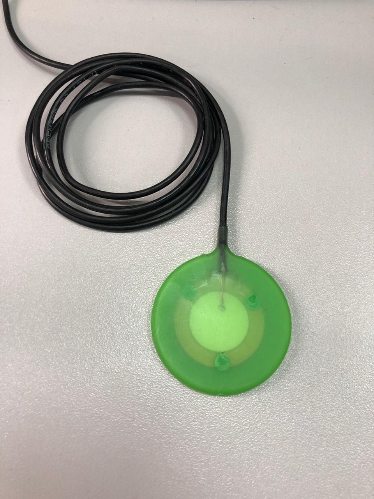

|  |  |
| :---: | ---: |
| [www.diy.unavlab.com](https://www.diy.unavlab.com/)   [support@unavlab.com](mailto:support@unavlab.com) | **RT-1.d23h03-1**   Hydroacoustic transducer   Device specifications |

## KEY FEATURES

* Inexpensive, simple, lightweight and miniature antenna based on a plate piezoelectric element
* Maintenance-free monoblock design
* Complete absence of corrodable elements  

## TECHNICAL SPECIFICATIONS

| PARAMETER | VALUE |
| :--- | :--- |
| DIMENSIONS (Ф х h) | 54 х 4 mm |
| WEIGHT (dry, w and w/o cabke) | 16/32 g |
| MAXIMUM SUPPLY VOLTAGE (PEAK)  | 200 V |
| ELECTRIC CAPACITY | 30 +/- 5 нФ |
| MAXIMUM EXTERNAL HYDROSTATIC PRESSURE | 30 Bar |
| CABLE LENGTH | 1.5 m |
| WORKING TEMPERATURE RANGE | -40..+60 °С |
| CABLE | RG-174 |
| CABLE COVER MATERIAL | PVC |
| CABLE DIAMETER | 3 mm |

## DRAWINGS

### Wire function description

| № | Color/Name | Function |
| :---: | :--- | :--- |
| 1 | SHIELD | COMMON |
| 2 | CENTRAL CORE | SIGNAL |

## ADDITIONAL PARAMETERS

