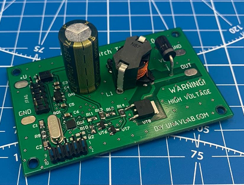
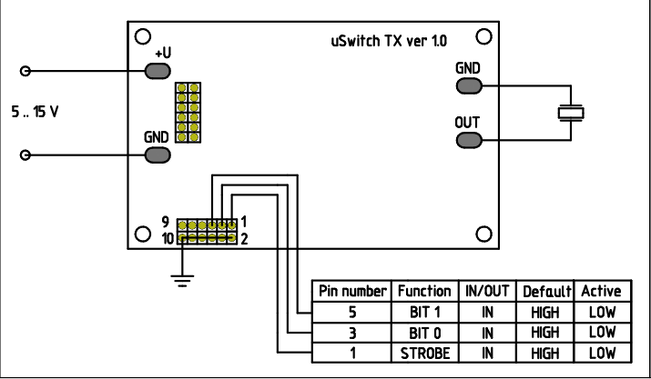
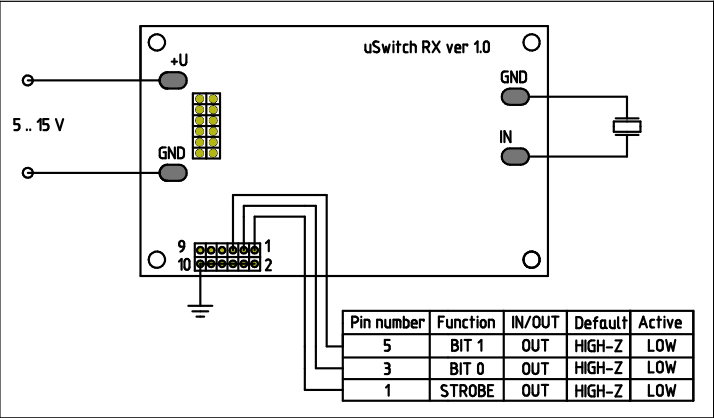
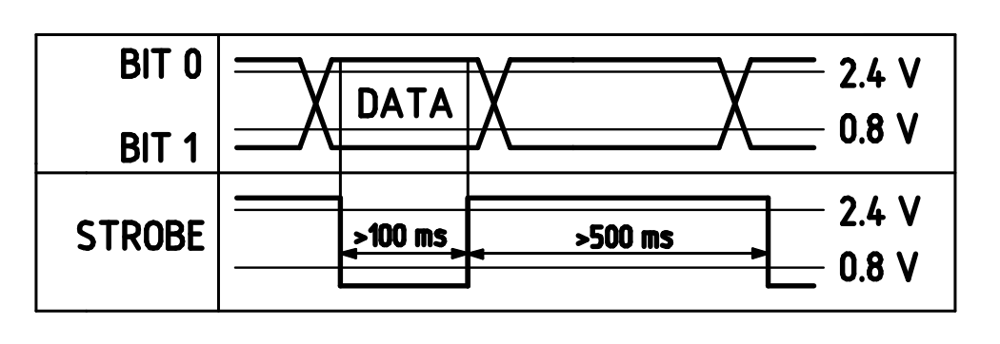

|  |  |
| :---: | ---: |
| [www.unavlab.com](https://www.unavlab.com/)   [support@unavlab.com](mailto:support@unavlab.com) | **uSwitch** - Гидроакустическая система телеуправления   Краткое описание |

# **uSwitch** - гидроакустическая система телеуправления   Краткое описание

## 0. Мотивация
Мы разрабатываем широкий спектр профессионального оборудования гидроакустической связи и навигации с применением самых передовых технологий в нашей области. Такое оборудование весьма сложно в разработке и тестировании, что естественным образом вляиет на доступность его для широкого круга потребителей. 
В тоже самое время мы верим, что доступность технологий, особенно для новых поколений исследователей и инженеров чрезвычайно важна. Именно поэтому мы идем по направлению популяризации гидроакустики, и надеемся, что **uSwitch** станет одним из тех проектов, которые позволят большому числу энтузиастов и любителей _погрузиться_ в мир подводной связи. Ведь большая часть мирового океана все еще не исследована!

## 1. Принцип действия
[uSwitch TX](uSwitch_TX_Specification_ru) и [uSwitch RX](uSwitch_RX_Specification_ru) - две небольшие печатные платы (модули): передатчик и приемник. При помощи них вы можете передавать до 8 различных сигналов управления через толщу воды, на дистанции до 300 метров.

Работа с модулями исключительно проста: достаточно подключить гидроакустические антенны и подать питание.
На каждом из модулей есть контакты **STROBE**, **BIT 0**, **BIT 1**. В _передатчике_ это _цифровые входы_, а в _приемнике_ - _цифровые выходы_.
По умолчанию все эти контакты и на приемнике и на передатчике установлены в состояние цифровой единицы (3.3 Вольта). 

Передаваемый код формируется состоянием контактов (пинов) **BIT 0**, **BIT 1**, а передача происходит, когда состояние пина **STROBE** переходит из состояния цифровой единицы в стотояние цифрового нуля.

На приемной стороне принятый код вызывает изменение пинов **BIT 0**, **BIT 1**, а факт приема - переходом пина **STROBE** в состояние цифрового нуля.

Так как есть два _информационных_ пина (**BIT 0**, **BIT 1**) и у каждого может быть два цифровых состояния, то всего можно передать **4** различных кодов.

Такая архитектура позволяет использовать модули **uSwitch** как с различными платформами типа **Arduino**, так и при помощи простых элементов типа кнопки, светодиодов, реле и прочих, управляемых при помощи TTL-уровней.

## 2. Использование модулей

На рисунках 1 и 2 приведены схемы подключения.

Оба модуля питаются от источника постоянного тока напряжением от 5 до 15 вольт, что позволяет использовать для питания модулей как **USB-порт** ПК, **Power bank**, так и **свинцовые** 12-вольтовые аккумуляторы, сборки на основе **Li-Ion** аккумуляторов и просто элементы 9-ти вольтовые элементы питания типа **"Крона"**.

Гидроакустическая передающая антенна подключается к площадкам **OUT** и **GND**, расположенным в правой части печатной платы модуля передатчика.

| |
| :---: |
|  |
| Рис. 1 - Схема подключения модуля передатчика [uSwitch TX](uSwitch_TX_Specification_ru) |

Гидроакустическая приемная антенна подключается к площадкам **IN** и **GND**, расположенным в правой части печатной платы модуля приемника.

| |
| :---: |
|  |
| Рис. 2 - Схема подключения модуля приемника [uSwitch RX](uSwitch_RX_Specification_ru) |

На обоих модулях для сопряжения с внешними устройствами используются одни и те же пины, на передатчике - это цифровые входы, притянутые к единице, а на приемнике - цифровые выходы с открытым коллектором.
Активное состояние входов передатчика - цифровой ноль.
Для удобства подключения, нижняя часть разъема подключена к земле. 

Для передачи одно из четырех кодов, при помощи пинов **3**, **5** (**BIT 0**, **BIT 1** соответственно) формируется передаваемый код. Соответствие номера кода и состояние пинов отражено в таблице 1.

При приеме кода модулем приемника, он, при помощи пинов **3**, **5** (**BIT 0**, **BIT 1** соответственно) формирует принятый код и переводит пин **1** (**STROBE**) в состояние цифрового нуля на 100 миллисекунд. Таким образом, подключенная к нему система должна считать состояние пинов **3**, **5** после перехода пина **1** в состояние цифрового нуля.

#### Таблица 1 - Соответствие состояние пинов и передаваемых/принимаемых кодов

| **BIT 0** (pin 3) | **BIT 1** (pin 5) | Передаваемый код |
| :---: | :---: | :---: |
| 0 | 0 | 0 | 
| 1 | 0 | 1 |
| 0 | 1 | 2 |
| 1 | 1 | 3 |
| 0 | 0 | 4 |
| 1 | 0 | 5 |
| 0 | 1 | 6 |
| 1 | 1 | 7 |

После формирования передаваемого кода, для его передачи по гидроакустическому каналу, пин **1** (**STROBE**) должен быть переведен в состояние цифрового нуля на время, не менее 100 миллисекунд. Повторная передача может производится не ранее чем через 500 миллисекунд после начала предыдущей.

Временная диаграмма взаимодействия с модулями приведена на рисунке 3:

| |
| :---: |
|  |
| Рис. 3 - Временная диаграмма взаимодействия с модулями |

## 3. Гидроакустичемкие антенны
Модуль [передатчика](uSwitch_TX_Specification_ru) рассчитан на работу с антенной [RT-1.332820-1](https://docs.unavlab.com/documentation/RU/Transducers/RT_1_332820_1_Specification_ru.html), а к модулю [применика](uSwitch_RX_Specification_ru) можно подключать практически любую пьезокерамическую гидроакустическую антенну, например, недорогую [RT-1.d23h03-1](/products/Transducers/RT_1_d23h03_1_ru) на основе дискового пьезоэлемента.
При желании, вы можете изготовить ее самостоятельно, воспользовавшись [нашими инструкциями](/projects/disk_hydrophone/README_RU.html).

## 4. Ограничения
### 4.1. Ограничения со стороны распространения звука в воде
Гидроакустический канал связи является одним из самых сложных для передачи информации, поэтому необходимо иметь в виду следующие условия для работы любой гидроакустической системы связи:
- для работы всегда нужна "прямая видимость". Это значит, что на пути акустического сигнала между передатчиком и приемником не должны быть никаких препятствий: элементов подводного ландшафта, плотных зарослей водорослей, элементов инфраструктуры (например, судов с низкой осадкой, опор мостов, причальных стенок и т.п.). 
- антенны и приемника и передатчика должны быть на достаточной глубине, как минимум 1-1.5 метра в крупных водоемах.
- сильная зашумленность в водоемах (например, в виду активного судоходства или каких-то природных факторов) также может значительно влиять на качество связи и максимальную дальность работы гидроакустических систем.

### 4.2. Ограничения архитектуры
Мы постарались сделать максимально доступные и максимально функциональные устройства, в чем-то нам пришлось пойти на компромисс. Т.к. различные коды передаются последовательно передаваемыми тональными посылками, то достоверность кодов неодинаковая и убывает с увеличением кода. Если вам требуется использовать менее четырех кодов, то следует отдавать предпочтение младшим кодам.

## 5. Предупреждение
**Пьезокерамические гидроакустические антенны устроены так, что развиваемое ими давление сильно зависит от подаваемого на них напряжения, поэтому в модуле передатчика в момент излучения сигнала возникает опасное для жизни высокое напряжение, амплитуда которого достигает 200 Вольт. Принимайте все требуемые меры защиты: во время работы передатчика никогда не прикасайтесь руками и любыми другими частями тела к плате и месту подключения гидроакустической антенны!!!**

## 6. FAQ
**Q**: *Есть ли ограничение на количество приемников, работающих с одним передатчиком?*  
**А**: **Таких ограничений нет: все устройства работают в общей полосе частот. Сколько угодно приемников примут сигнал от передатчика, при условии что он до них дойтет. Однако, учитывая скорость звука в воде (порядка 1500 м/с) это может произойти в разное время, с задержкой, пропорциональной дальности.**  

**Q**: *Возможно ли работать на одном водоеме несколькими комплектами системы?*  
**A**: **Нужно учитывать, что все устройства работают в общем диапазоне и любой приемник будет реагировать на любой передатчик, если сигнал до него доходит. Пользователю придется самостоятельно обеспечивать разделение сигналов по времени.**  

**Q**: *Приемник может различать сигналы от разных передатчиков?*  
**A**: **Нет. Такой возможности не предусмотрено.**  

**Q**: *Почему такая разница в дальностях при использовании антенн [RT-1.332820-1](https://docs.unavlab.com/documentation/RU/Transducers/RT_1_332820_1_Specification_ru.html) и [RT-1.d23h03-1](/products/Transducers/RT_1_d23h03_1_ru) в качестве передающих, 300 метров против 40?*  
**A**: **Говоря простыми словами, дальность передачи определяется чувствительностью приемника и давлением, развиваемым передающей антенной. Плоская и недорогая антенна не позволяет закачать в нее требуемую мощность.**  

**Q**: *А можно питать модуль передатчика от батареек?*  
**A**: **Да, подойдет батарейка 9V типа "Крона"**  

**Q**: *Могут ли влиять на работу системы акустические или электрические помехи?*  
**A**: **Да. Приемник наиболее уязвим в этом смысле. Наиболее неблагоприятны шумы в рабочей полосе - 20-30 кГц.**  

**Q**: *Для моей задачи требуется большее число управляющих сигналов и большая дальность, можно ли как-то доработать систему?*
**A**: **Система задумывалась как любительская, и текущие характеристики являются фактически предельными для используемой платформы. Если требуется большее число управляющих посылок и/или передача произвольных данных, большая дальность и надежность, то рекомендуем обратить внимание на наши микромодемы [uWAVE](https://docs.unavlab.com/underwater_acoustic_modems_ru.html#uwave)**

**Q**: *Мне требуется обратная связь, как это можно обеспечить?*
**A**: **Наиболее простой способ использовать две пары приемник-передатчик, соединив обе пары по 1 в 1 по пинам.**

