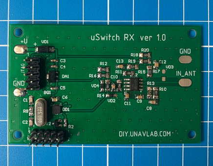

|  |  |
| :---: | ---: |
| [www.diy.unavlab.com](https://diy.www.unavlab.com/)   [support@unavlab.com](mailto:support@unavlab.com) | **uSwitch RX** - Hydroacoustic RC system (RX module)   Device specifications |

## KEY FEATURES

* **Maximum ease of use and integration**
* **Receives up to 4 control codes**
* **Communication range up to 300 [1](#footnote1),[2](#footnote2) m**
* **Low power consumption - 20 mA**

## DESCRIPTION
The module is made in the form of a printed circuit board, to which a hydroacoustic receiving antenna (hydrophone) is connected.
The device is designed to receive hydroacoustic (ultrasonic) signals generated by the [uSwitch TX](uSwitch_TX_Specification_en) module.

The TX and RX modules are specially designed by us for the DIY community, enthusiasts, underwater RC model makers as an affordable underwater telecontrol system.

Working with the device is as simple as possible: when the control signal is received via the hydroacoustic channel, digital levels are formed at the outputs, signalling the user about the fact of receiving the signal and the received code (two digital outputs form 4 variants of the received codes).

## TECHNICAL SPECIFICATIONS

| PARAMETER | VALUE |
| :--- | :--- |
| DIMENSIONS (L х W х H) | 46 x 75 х 12 mm |
| MAX. ACOUSTIC RANGE[1](#footnote1),[2](#footnote2),[5](#footnote5) | 300 m |
| POWER CONSUMPTION | 20 mA |
| SUPPLY VOLTAGE[2](#footnote2),[3](#footnote3) | 5 .. 15 V |
| DATA LINES VOLTAGE[3](#footnote3) | 0 .. 5 V |
| BANDWIDTH[4](#footnote4) | 21 .. 29 kHz |
| MAX. NUMBER OF CONTROL CODES | 4 |
| MIN. TIME BETWEEN TWO MESSAGES | 500 ms |
| MAX. MESSAGE DURATION | 100 ms |
| MAX. RELATIVE VELOCITY | +/- 2 m/s |
| WORKING TEMPERATURE RANGE | -5 .. 50 °C |
| DIGITAL OUTPUTS | TTL |
  
________________
<a name="footnote1">1</a> A parameter that determines the maximum range at which a signal can be received, based on the electro-acoustic parameters of the transmitter and receiver, the spatial decrease in the intensity of sound energy, attenuation in the medium and the level of hydroacoustic noise.  
<a name="footnote2">2</a> The maximum communication range is achieved when the [transmitter module](uSwitch_TX_Specification_en) is supplied with the maximum voltage allowed for it.  
<a name="footnote3">3</a> The specified voltage limits, functionality and serviceability of the module is not guaranteed beyond the specified range.  
<a name="footnote4">4</a> The module uses narrowband tones located in the specified frequency range.  
<a name="footnote5">5</a> The [transmitter module](uSwitch_TX_Specification_en) is optimized for working with [RT-1.332820-1](https://docs.unavlab.com/documentation/EN/Transducers/RT_1_332820_1_Specification_en.html) antenna and the maximum range was determined experimentally with this antenna, when working with other piezoceramic antennas the range can differ significantly.  
