|  |
| :---: |
| [www.diy.unavlab.com](https://diy.unavlab.com/)   [support@unavlab.com](mailto:support@unavlab.com) |
| [**EN**](README.md) \| [**RU**](README_RU.md) |

# Making a disc hydrophone

> _"Hydroacoustician has drunk his hydrophone away" (C) Russian joke_  

### Contents

- [0. Disclaimer](#0-disclaimer)
- [1. What will be the result?](#1-what-will-be-the-result)
- [2. What do we need?](#2-what-do-we-need)
  - [2.1. Bill of materials](#21-bill-of-materials)
  - [2.2. Tools and equipment](#22-tools-and-equipment)
  - [2.3. Casting mold](#23-casting-mold)
- [3. Assembling the hydrophone](#3-assembling-the-hydrophone)
- [4. Pouring](#4-pouring)
- [5. Testing](#5-testing)

## 0. Disclaimer
**We are not responsible if you get hurt while following this lesson. By following this lesson, you agree that you are acting at your own risk. Strictly follow the rules and safety precautions when working with this or that tool or materials**

## 1. What will be the result?
At the output, we will have a sensitive disk hydrophone, supplementing which with a preamplifier, we will be able to record hydroacoustic signals in the frequency range from about 10 to 40 kHz: the sounds of fish and marine mammals, the noises of ships and boat engines, and even the noise of a snowstorm and the creak of footsteps on ice, if you want to study the sounds in the reservoirs, encased in ice crust. 

This is how your new hydrophore will look like:

| 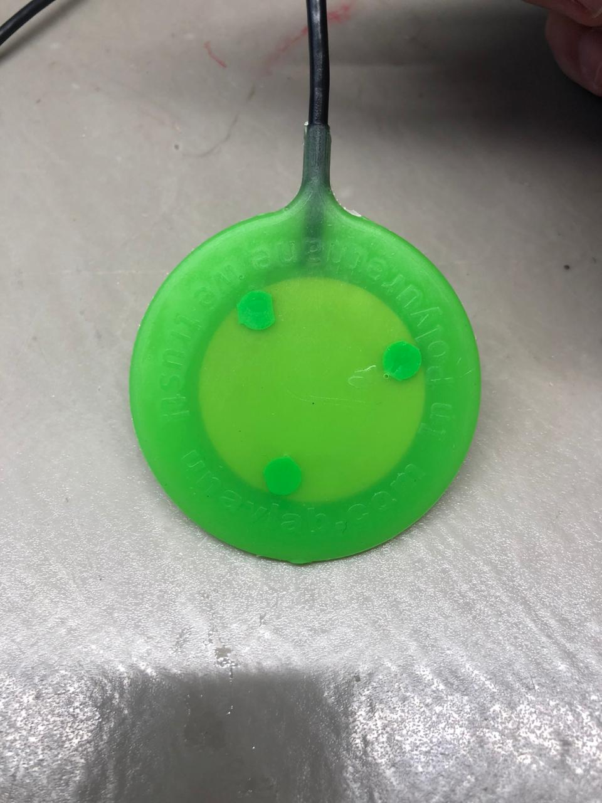 |
| :---: |
| fig. 1 - The hydrophone - the end goal of this tutorial |

The hydrophone is the main instrument that mediates for us between the worlds - ours and underwater. That is why, with the manufacture of a homemade hydrophone, we begin a whole cycle of educational articles for _diving_ into the world of underwater sound.

## 2. What do we need?
### 2.1. Bill of materials

#### Table 1 - Bill of materials

| № | Meterial | Quantity | Notes |
| :--- | :--- | :--- | :--- |
| 1 | Piezoceramic disc Ф35 mm [Murata 7BB-35-3C](https://www.murata.com/en-eu/products/productdetail?partno=7BB-35-3C) or similar | 1 pcs |
| 2 | Coaxial cable RG-174 | 2 m | |
| 3 | Polyurethane compound [Smooth-On Vytaflex 60](https://www.smooth-on.com/products/vytaflex-60/) | 2 х 50 g | The volume of the finished mixture for two pourings is indicated. |
| 4 | Releasing agent [Ease Release 200 ](https://www.smooth-on.com/products/ease-release-200/) | little =) | |
| 5 | Soft solder Ф0.5 - 1 mm | little =) | |
| 6 | Neutral alcohol rosin flux | little =) | |
| 7 | Sandpaper 150-200 grit | 1 х 5 cm strip | |
| 8 | Isopropyl alcohol | little =) | |
| 9 | Janet's syringe (aka flushing 140 ml) | 2 pcs | for two pourings |
| 10 | 20 ml syringe | 4 pcs | for two pourings |
| 11 | 500 ml plastic cup | 2 pcs | for two pourings |
| 12 | Wooden stick Ф3-5 mm and length 30 cm | 2 pcs | for two pourings |
| 13 | Paper napkins or toilet paper | 1 pack/roll | |
| 14 | Acetone | 100 ml | for cleaning polyurethane compound components in case of spills |

In our work, we use another polyurethane compound, which is quite difficult for an amateur to find, and it is not at all easy to work with it. Instead, we recommend a widely available compound that is also suitable for our task. You can try other compounds from other manufacturers (eg 3M, etc.). The main parameters for selection should be the so-called. _pot life_ - during which the compound _flows_. Choose compounds with a pot life of at least 20-30 minutes. The second parameter to keep in mind is the Shore hardness of the finished product (scale A): we recommend compounds with a hardness of about 60A.

### 2.2. Tools and equipment

#### Table 2 - Tools and equipment list

| № | Tool | Purpose |
| :--- | :--- | :--- |
| 1 | Soldering iron or soldering station with temperature setting |  |
| 2 | Side cutters / nippers | |
| 3 | Knife or scalpel | |
| 4 | Tweezers | |
| 5 | Vacuum chamber with pump | For degasing polyurethane compound |
| 6 | Multimeter | for checking before and after pouring |
| 7 | Digital oscilloscope | _desirable_ for checking |

### 2.3. Casting mold
Here we do not touch upon the issue of making a casting mold in detail: you can order its printing on a DLP 3D printer or on a CNC milling machine.
For example, we did just that: we printed the mold on a DLP printer [Anycubic Photon mono](https://www.anycubic.com/products/photon-mono-resin-3d-printer). If you want to make it on a milling machine, then we recommend using polyacetal (Delrin) or polyamide 6 as the material - these materials have high strength and nothing sticks to them. Delrin is significantly easier (and may be cheaper) to process than polyamide 6.
Printing using **FDM technology** is **not recommended** due to the unsatisfactory surface quality and high porosity of the resulting structure.

We provide for free use a 3D model of the form in STL format:
- [Left half of the form](mold_left.stl)
- [Right half of the form](mold_right.stl)

This is what the model looks like:  

|  |
| :---: |
| fig. 2 - 3D - model |

And this is the result of printing of this model:  

|  |
| :---: | 
| fig. 3 - casting mold, printed on DLP |

To tighten the mold, you will need four screws M8 x 1.25 x 20 mm (this is the thread in our model).  
  
Please note that the inlet of the mold is specially made for the use of Janet syringes and has a diameter of Ф7 mm Inside the mold, a part of the inlet channel is made in the form of successive cylindrical cavities.
This is done specifically so that part of the compound that has cured in the inlet channel can be used as spacers for subsequent pouring. Below we will tell you in more detail what to do with this.

## 3. Assembling the hydrophone
So. First, we strip 2-3 cm of the cable insulation. We recommend using a convenient tool right away - this will save time and nerves, as well as keep the cable shield intact.

| 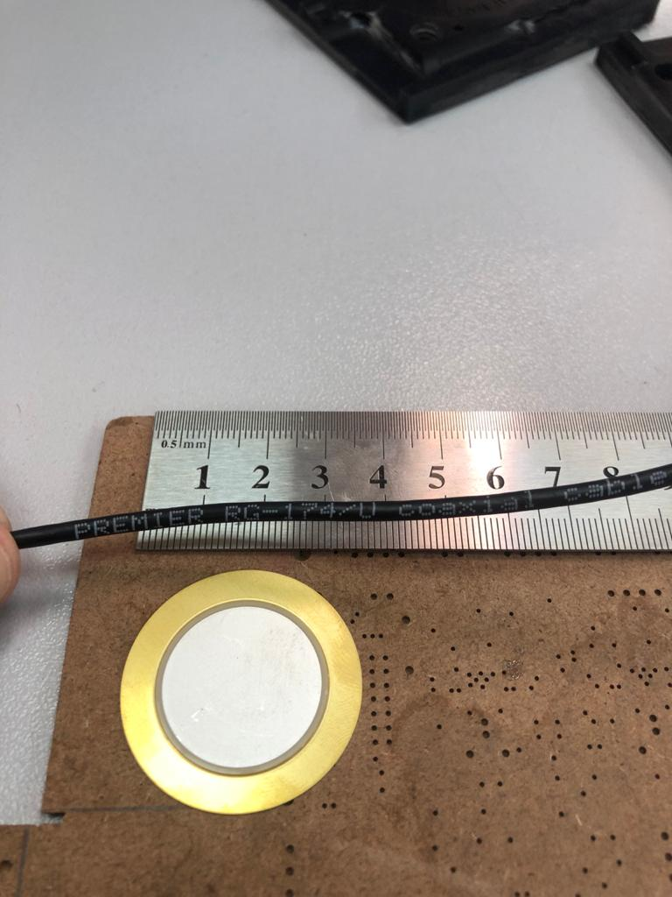 |
| :---: | 
| fig. 4 - preparations |

|  |
| :---: | 
| fig. 5 - stripping the insulation |

Next, we divide the cable shield into two equal parts and separate them in two opposite directions so as not to exceed the cable thickness (our mold is narrow - so that as little polyurethane layer as possible separates the piezo disk from the external environment). We bend the shield veins and cut them off. As a result, it should look like the following figure:

| 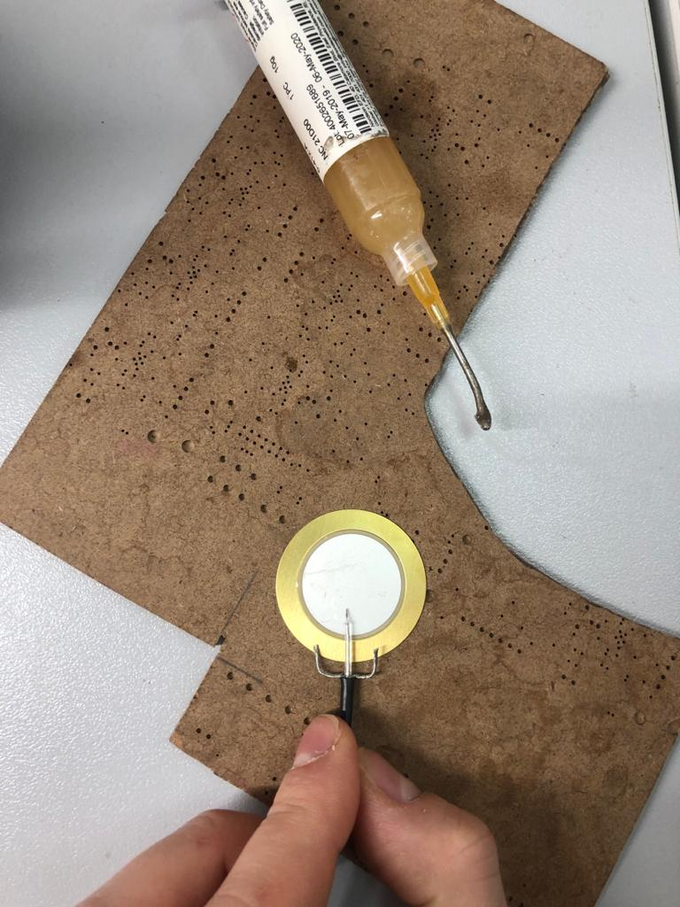 |
| :---: | 
| fig. 6 - conductors twisted, bent and cut in place |

Now let's take care of the soldering equipment. We turn on the soldering iron or soldering station and set the temperature to 250 ° C.

|  |
| :---: | 
| fig. 7 - settings temperature to 250 °С |

The connection of the cable and the metallization of the piezoelectric plate is a critical connection. Piezoceramics is sensitive to overheating, and the silver metallization layer is sensitive to the aggressive environment. Therefore, we recommend against using barbaric soldering methods such as aspirin or soldering acid. The best choice is a neutral flux, for example, we use this (don't count it as an advertisement):

|  |
| :---: | 
| fig. 8 - Flux that we use |

The flux is applied without fanaticism, exclusively at the soldering points. First, we solder the cable shield to the metal backing. If you can't solder right away, you can gently scratch the soldering area with a scalpel (you can only scratch the plate where the screen is soldered! You can't scratch the metallization on the surface of the piezoceramic plate!).
Duration of soldering one joint should not exceed 5 seconds.

The soldering process itself is shown in the following pictures:

| 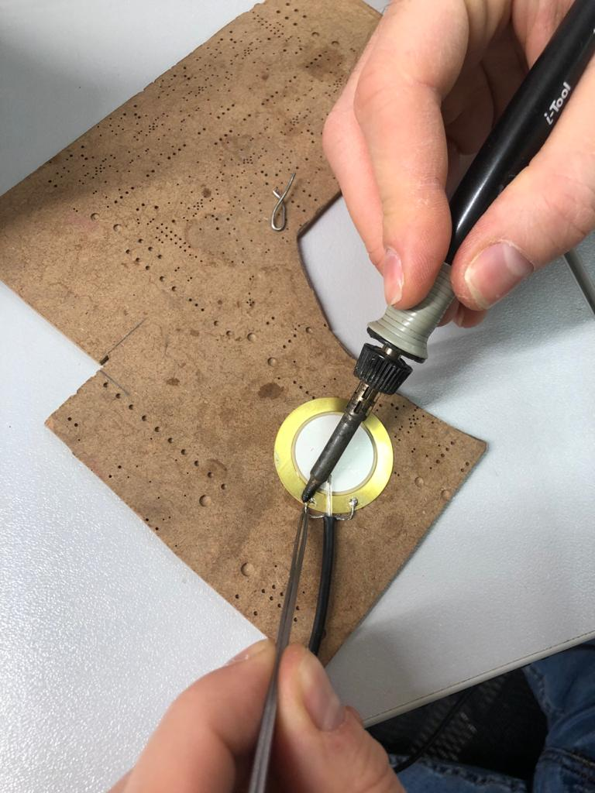 |
| :---: | 
| fig. 9 - First, we solder the shield |

| 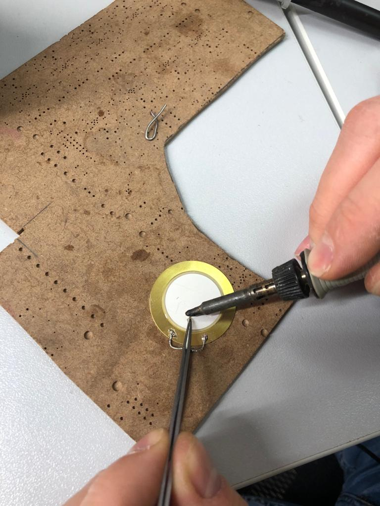 |
| :---: | 
| fig. 10 - We solder the central core |

|  |
| :---: | 
| fig. 11 - Soldering result |

Note that there is a gap between the disc and the edge of the outer cable insulation. If this is not done, the cable will stick out too much and after pouring it will remain sticking out, which will lead to the fact that there will be places where water can get inside the device bypassing the polyurethane casing or cable insulation.  

After soldering, the remaining flux must be washed off. Ethyl or isopropyl alcohol can be used. No other solutions (cologne, vodka, moonshine, gasoline, kerosene, etc.) can be used. We rub with a cotton swab on both sides.

|  |
| :---: | 
| fig. 12 - Flux cleaning |

Next, we take a multimeter and put it into resistance measurement mode. Make sure that there is no short circuit between the core and the cable shield. If there is, look for and eliminate the short circuit.

Now we can try on the future hydrophone in the mold.

|  |
| :---: | 
| fig. 13 - Fitting in the mold |

The location marked with the tip of the tweezers indicates where to sand the cable. It will need to be sanded before installation in the form, before the final degreasing.
In the meantime, it is necessary to glue polyurethane spacers - the same ones that are obtained from the previous pouring with nippers or scissors.
If you don't have such, then it's time to jump a little ahead and make a test pouring in the mold (without a piezo disk).

When the spacers are available (there should be just 6 of them), we glue them on both sides to the metal plate using superglue, again, without fanaticism.

| 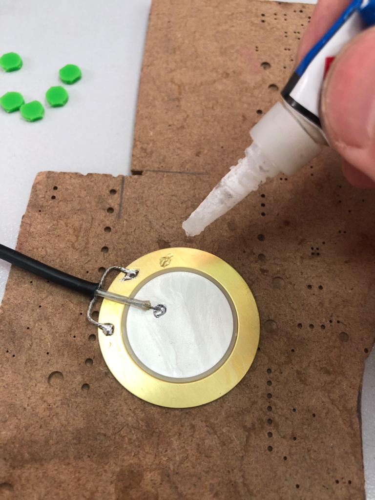 |
| :---: | 
| fig. 14 - Glueing spacers |

The result should look like this:

|  |
| :---: | 
| fig. 15 - Glueing spacers |

|  |
| :---: | 
| fig. 16 - Glueing spacers |

Now we sand the part of the cable insulation that will be covered with polyurethane:

| 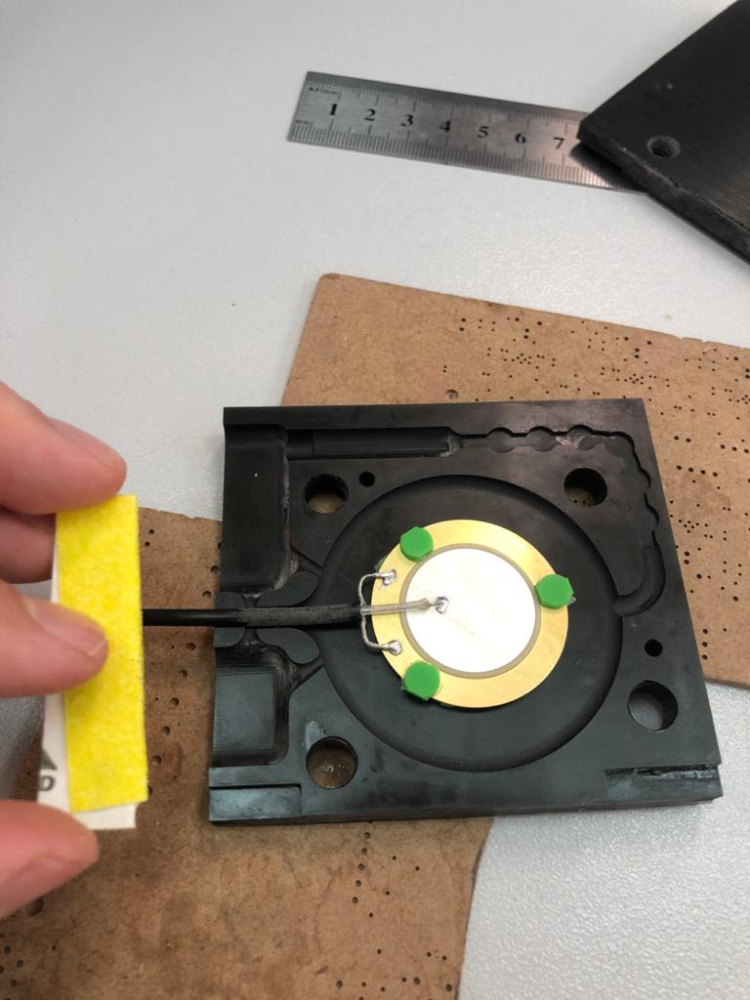 |
| :---: | 
| fig. 17 - Sanding the cable |

At this stage, the assembly of the hydrophone is completed. It's time to move on to the pouring.

## 4. Pouring

# PLEASE PLEASE PLEASE READ THE WARNING !!!

> **ATTENTION! For heaven's sake, use personal protective equipment: glasses, gloves. All work with reagents must be carried out in a very well-ventilated area (we do everything in fume hoods!). Take care of yourself - let humanity have a healthy scientist, with whole eyes and hands !!!**

> **No kidding - none of us will even take a screwdriver in hand without wearing goggles. We do not touch the components of the compound and solvents without gloves. All this is very unhealthy! Damn it, please take care of yourself! There are so few of us (engineers, scientists) and the quality is constantly decreasing =(.**

Before pouring, we finally degrease our hydrophone with alcohol.
Spray the shape with a releasing agent. Again, without fanaticism: we carefully read the instructions on the spray can.

|  |
| :---: | 
| fig. 18 - Applying the releasing agent |

Placing the hydrophone in the mold. Do not scratch the mold with it, we do not grab the releasing agent from the walls.

|  |
| :---: | 
| fig. 19 - Placing the hydrophone in the mold |

Cover with the second half, tighten the bolts. If your form is made using printing - tighten carefully: the material is quite fragile.

|  |
| :---: | 
| fig. 20 - Enclosed mold |

We will not repeat the pouring instructions supplied with the compound here. In a nutshell: the recommended compound is mixed in equal volume fractions.
It is convenient to prepare a 500 ml plastic disposable cup, take two 20 ml syringes, take both jars (polymer and cross-linker - components are usually labelled "A" and "B"). Put them on your left and right sides of you, sign the syringes accordingly - with some you will draw from jar "A", the other - from jar "B". If you stick a syringe soiled in one component into a jar with others - thus eventually throw away the leftovers into the trash. Do not do that.

So.
- Draw a full syringe from the jar "A" and pour it into the cup. Repeat. As a result, we have 40 ml of component "A" in the cup.
- Draw a full syringe from the jar "B" and pour it into the cup. Repeat. As a result, we have 40 ml of component "B" in the cup.
Those. the total volume of the mixture is 80 ml.
- Just in case, we start a stopwatch so as not to relax and not hesitate.
- Actively mix the contents of the cup with a wooden stick for 1-2 minutes.

| 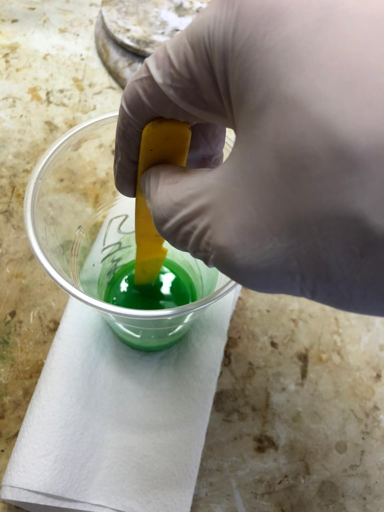 |
| :---: | 
| fig. 21 - Stirring the compound |

- Put the cup in the vacuum chamber and degas for 5 minutes from the moment when the pressure reached the minimum, but no more than 10 minutes!

|  |
| :---: | 
| fig. 22 - Degsing |

While the compound is being degasing, it's time to unpack Janet's syringe:

| 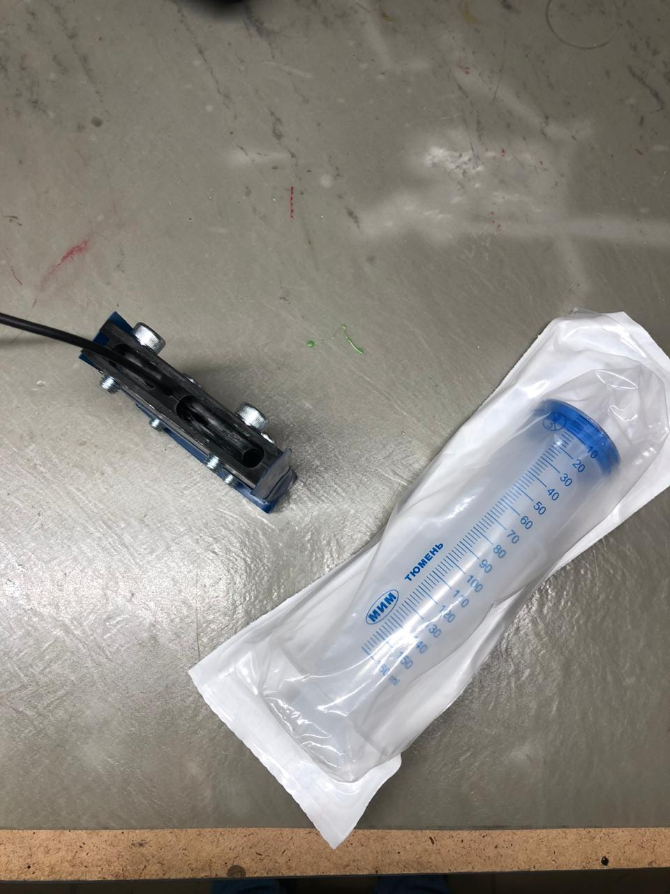 |
| :---: | 
| fig. 23 - Janet's syringe |

To draw a compound from a glass with a syringe - "this is the way to Hell, Francesco, my friend!" (C). Instead of this:
- remove the plunger from the syringe
- place the syringe with the nose down, while we pinch the nose with our finger
- pour the compound into the syringe from the cup, scraping along the walls with a stick
- carefully insert the stem back, gradually, sideways
- turn the syringe over and let the urethane drain to the bottom (top of the plunger)
- release your finger, wipe a drop of urethane with a napkin
- we bring the stem up so that the urethane almost reaches the edge of the spout.

|  |
| :---: | 
| fig. 24 - Ready for pouring |

That's it. You can pour:

| 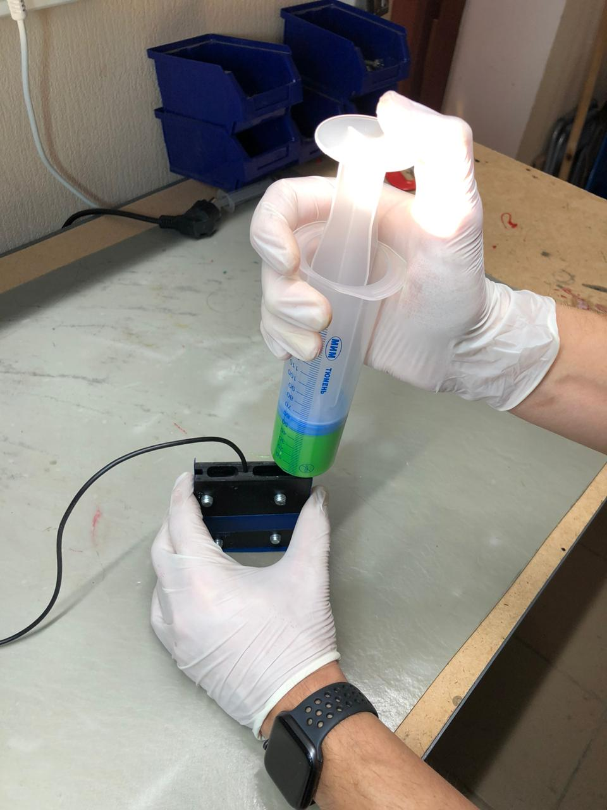 |
| :---: | 
| fig. 25 - Pouring process |

Pouring gradually. Until the moment when the urethane comes out of the exit channels. We stop at about this level:

|  |
| :---: | 
| fig. 26 - Pouring process |

This is where the pouring ends and the polyurethane takes time to cure. We leave everything at the manufacturer's recommended temperature for 24 hours.
The mold is small enough, so we do not degas it - it is enough to degas the compound in a cup. As a rule, there are practically no bubbles in such forms if everything was done correctly: the compound is quickly and efficiently mixed, degassed and the temperature regime is observed.

## 5. Testing
After 24 hours, the mold can be opened.
I wrote this tutorial literally as we made it and we actually opened the form in about 24 hours. Here's what we saw:

| 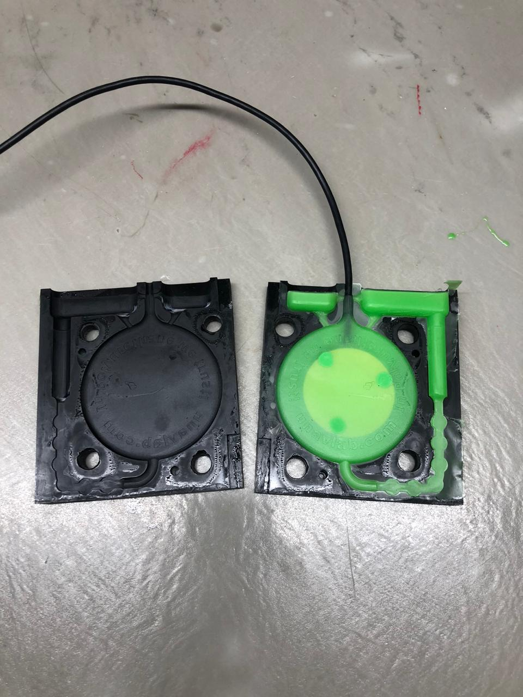 |
| :---: | 
| fig. 27 - Opening the mold |

If there are serious pouring defects, re-read the instructions for the compound again, perhaps you did something wrong:
- proportions not respected
- mixed and degassed too long (not degassed?)
- temperature regime is not observed
- took in a lot of air when pouring into a syringe, etc.

The hydrophone is flat and shouldn't be too difficult to remove from the mold. Just in case, I will mention that we are trying to pull the sprues (not the cable!).

We cut the sprues with nippers or scissors.
A thin film formed due to the loose fit of parts of the form is easily torn off by hand.

| 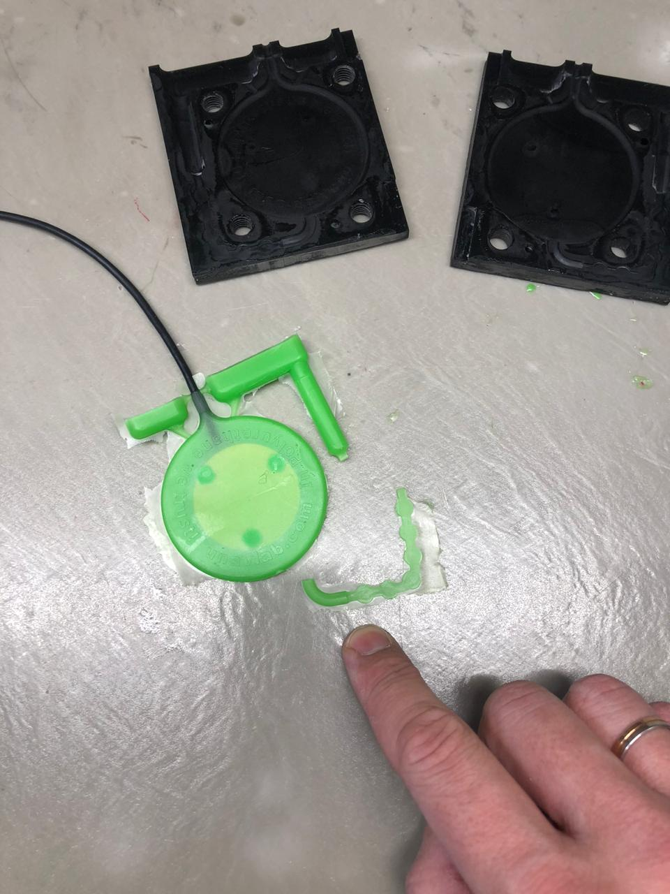 |
| :---: | 
| fig. 28 - A new batch of spacers for the next hydrophone |

We don’t throw away the resulting spacers - they will go to the next hydrophone!

So, if everything worked out as planned, then let's check our hydrophone.
The most convenient way to do this is to use an oscilloscope:

|  |
| :---: | 
| fig. 29 - When tapping with a finger, "pokes" are visible on the screen |

An interesting effect associated with the polarization of the piezoceramic disc: when tapping from the front side, a positive impulse occurs, and when tapping from the backside, a negative one. This is something to keep in mind if you are connecting several of these hydrophones together.  

|  |
| :---: | 
| fig. 30 - Measuring the amplitude of the pulses |

From peak to peak, we get about 2.7 volts.

**Well, congratulations on your new hydrophone, you are great! =)**

It is not very convenient to use this hydrophone directly: it has too low sensitivity. In order for it to become truly useful, it must be equipped with a preamplifier and bandpass filter.
We will explain how to make a preamplifier for your new hydrophone in the next article.

_______  
[Contents](#contents)

