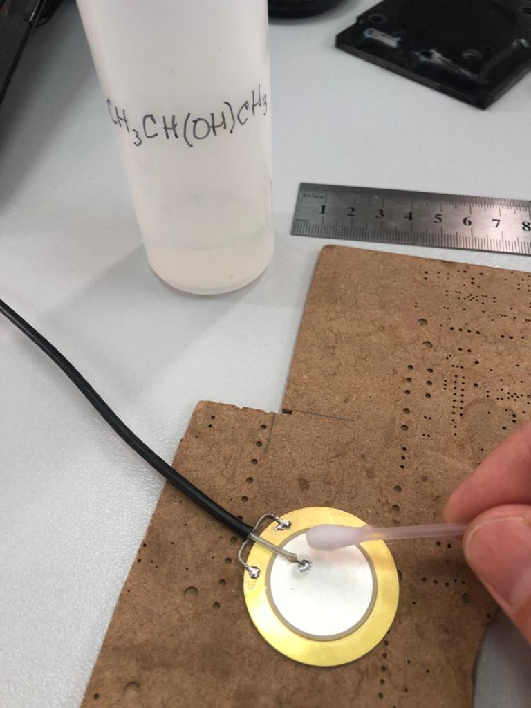
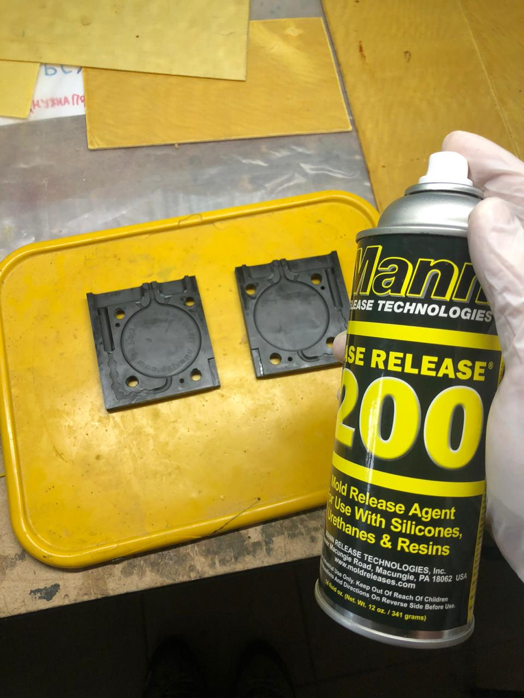

|  |
| :---: |
| [www.diy.unavlab.com](https://diy.unavlab.com/)   [support@unavlab.com](mailto:support@unavlab.com) |
| [**EN**](README.md) \| [**RU**](README_RU.md) |

# Изготовление дискового гидрофона

> _"Гидроакустик гидрофон пропил" (C)_  

### Содержание

- [0. Дисклеймер](#0-%D0%B4%D0%B8%D1%81%D0%BA%D0%BB%D0%B5%D0%B9%D0%BC%D0%B5%D1%80)
- [1. Что получится в результате?](#1-%D1%87%D1%82%D0%BE-%D0%BF%D0%BE%D0%BB%D1%83%D1%87%D0%B8%D1%82%D1%81%D1%8F-%D0%B2-%D1%80%D0%B5%D0%B7%D1%83%D0%BB%D1%8C%D1%82%D0%B0%D1%82%D0%B5)
- [2. Что нам понадобится?](#2-%D1%87%D1%82%D0%BE-%D0%BD%D0%B0%D0%BC-%D0%BF%D0%BE%D0%BD%D0%B0%D0%B4%D0%BE%D0%B1%D0%B8%D1%82%D1%81%D1%8F)
  - [2.1. Материалы](#21-%D0%BC%D0%B0%D1%82%D0%B5%D1%80%D0%B8%D0%B0%D0%BB%D1%8B)
  - [2.2. Инструменты и оборудование](#22-%D0%B8%D0%BD%D1%81%D1%82%D1%80%D1%83%D0%BC%D0%B5%D0%BD%D1%82%D1%8B-%D0%B8-%D0%BE%D0%B1%D0%BE%D1%80%D1%83%D0%B4%D0%BE%D0%B2%D0%B0%D0%BD%D0%B8%D0%B5)
  - [2.3. Заливочная форма](#23-%D0%B7%D0%B0%D0%BB%D0%B8%D0%B2%D0%BE%D1%87%D0%BD%D0%B0%D1%8F-%D1%84%D0%BE%D1%80%D0%BC%D0%B0)
- [3. Сборка гидрофона](#3-%D1%81%D0%B1%D0%BE%D1%80%D0%BA%D0%B0-%D0%B3%D0%B8%D0%B4%D1%80%D0%BE%D1%84%D0%BE%D0%BD%D0%B0)
- [4. Заливка](#4-%D0%B7%D0%B0%D0%BB%D0%B8%D0%B2%D0%BA%D0%B0)
- [5. Проверка](#5-%D0%BF%D1%80%D0%BE%D0%B2%D0%B5%D1%80%D0%BA%D0%B0)

## 0. Дисклеймер
**Мы не несем ответственности, если вы поранитесь или каким-то образом пострадаете во время выполнения этого туториала. Следуя этому туториалу, вы соглашаетесь с тем, что действуете на свой страх и риск. Строго соблюдайте правила и технику безопасности при работе с тем или иным инструментом или материалами.**

## 1. Что получится в результате?
На выходе у нас получится достаточно чувствительный дисковый гидрофон, дополнив который предусилителем, мы сможем записывать гидроакустические сигналы в диапазоне частот примерно от 10 до 40 кГц: [звуки рыб](https://www.popmech.ru/popmem/646393-shvedskie-podlodki-15-let-slushali-kak-pukaet-seledka/) и морских млекопитающих, шумы двигателей судов и лодок и даже шум снежной метели и скрип шагов по льду, если вы захотите поизучать звуки в водоемах, закованных в ледяную корку. 

Вот так будет выглядить ваш новый гидрофон в итоге:

|  |
| :---: |
| рисунок 1 - Гидрофон - конечная цель этого туториала |

Гидрофон - это основной инструмент, который является для нас посредником между мирами - нашим, привычным, и подводным. Именно по этому, с изготовления самодельного гидрофона мы начинаем целый цикл обучающих статей для _погружения_ в мир подводного звука. 

## 2. Что нам понадобится?
## 2.1. Материалы

### Таблица 1 - Список материалов

| № | Материал | Колчитество | Примечания |
| :--- | :--- | :--- | :--- |
| 1 | Диск пьезокерамический Ф35 мм [Murata 7BB-35-3C](https://www.murata.com/en-eu/products/productdetail?partno=7BB-35-3C) или аналогичный | 1 шт |
| 2 | Кабель коаксиальный RG-174 | 2 м | |
| 3 | Полиуретановый компаунд [Smooth-On Vytaflex 60](https://www.smooth-on.com/products/vytaflex-60/) | 2 х 50 г | Указан объем готовой смеси для двух заливок |
| 4 | Разделитель для форм [Ease Release 200 ](https://www.smooth-on.com/products/ease-release-200/) | немного =) | |
| 5 | Мягкий припой, например ПОС-61 Ф0.5 - 1 мм | немного =) | |
| 6 | Флюс спиртоканифольный нейтральный | немного =) | |
| 7 | Наждачная бумага 150-200 grit | полоска 1 х 5 см | |
| 8 | Спирт изопропиловый | немного =) | |
| 9 | Шприц Жане (он же промывочный 140 мл) | 2 шт | для двух заливок |
| 10 | Шприц 20 мл | 4 шт | для двух заливок |
| 11 | Пластиковый стаканчик 500 мл | 2 шт | для двух заливок |
| 12 | Деревянная палочка Ф3-5 мм и длиной 30 см | 2 шт | для двух заливок |
| 13 | Салфетки бумажные или туалетная бумага | 1 пачка/рулон | |
| 14 | Ацетон | 100 мл | для отмывки компонентов уретановго компаунда в случае пролития |

В работе мы используем другой полиуретановый компаунд, который для любителя найти достаточно сложно, да и работать с ним совсем не просто. Вместо этого мы рекомендуем легкодоступный и широкораспространенный компаунд, который тоже подходит для нашей задачи. Вы можете попробовать и другие компаунды от других производителей (например 3M и т.п.). Основными параметрами для выбора должны быть т.н. _время жизни_ (pot life) - в течение которого компаунд _течет_. Выбирайте компаунды с временем жизни не меньше 20-30 минут. Второй параметр, который нужно иметь в виду - твердость готового изделия по Шору (шкала А): мы рекомендуем компаунды с твердостью порядка 60А.

## 2.2. Инструменты и оборудование

### Таблица 2 - Список инструментов и оборудования

| № | Инструмент/Прибор | Назначение |
| :--- | :--- | :--- |
| 1 | Паяльник или паяльная станция с возможностью задания температуры 250 °С |  |
| 2 | Бокорезы/кусачки | |
| 3 | Нож или скальпель | |
| 4 | Пинцет | |
| 5 | Вакуумная камера с насосом | Для вакуумирования полиуретанового компаунда |
| 6 | Мультиметр | для проверки перед и после заливки |
| 7 | Цифровой осциллограф | _желателен_ для проверки |

## 2.3. Заливочная форма
Здесь мы не касаемся подробно вопроса изготовления заливочной формы: вы можете заказать ее печать на DLP 3D принтере или на фрезерном станке с ЧПУ. 
Мы например, так и поступили: распечатали форму на DLP принтере [Anycubic Photon mono](https://www.anycubic.com/products/photon-mono-resin-3d-printer). Если вы захотите выполнить ее на фрезерном станке, то в качестве материала мы рекомендуем использовать полиацеталь (Delrin) или капролон - эти материалы имеет высокую прочность и к ним ничего не прилипает. Delrin значительно более прост в обработке чем капролон.
Печать при помощи технологии FDM не рекомендуется в виду неудовлетворительного качества поверхности и высокой пористости получаемой конструкции.

Мы предоставляем в свободное пользование 3D модель формы в формате STL:
- [Левая половина формы](mold_left.stl)
- [Правая половина формы](mold_right.stl)

Вот так выглядит модель:  

|  |
| :---: |
| рисунок 2 - 3D - модель формы |

А вот так - результат печати по этой модели:  

|  |
| :---: | 
|  рисунок 3 - форма, распечатанная на DLP-принтере |

Для стягивания формы вам понадобятся четыре винта М8 х 1.25 х 20 мм (в нашей модели именно такая резъба).

Обратите внимание, что входное отверстие формы специально сделано для применения шприцев Жанэ и имеет диаметр Ф7 мм. Внутри формы часть входного канала выполнена в виде последовательных циллиндрических полостей.
Это сделано специально для того, что бы часть компаунда, заполимеризовавшегося во входном канале, могла быть использована в качестве прокладок для последующей заливки. Далее мы расскажем подробней, что с этим делать.

# 3. Сборка гидрофона

Итак. Сначала зачищаем 2-3 см кабеля от изоляции. Рекомендуем сразу пользоваться удобным инструментом - это позволит сэкономить время и нервы, а также сохранить экран кабеля целым.

|  |
| :---: | 
|  рисунок 4 - подготовка |

|  |
| :---: | 
|  рисунок 5 - зачищаем кабель |

Далее разделяем экран кабеля на две равные части и разводим их в две противоположные стороны, чтобы не превысить толщину кабеля (наша форма узкая - чтобы как можно меньший слой полиуретана отделял пьезодиск от внешней среды). Подгибаем экранные жилы и обрезаем. В итоге должно получиться как на следующем рисунке:

|  |
| :---: | 
|  рисунок 6 - жилы скручены, согнуты и обрезаны по месту |

Теперь позаботимся о паяльном оборудовании. Включаем паяльник или паяльную станцию и выставляем температуру 250 °С.

|  |
| :---: | 
|  рисунок 7 - устанавливаем температуру на 250 °С |

Соединение кабеля и металлизации пьезопластины - это ответственное соединение. Пьезокерамика чувствительна к перегреву, а серебрянный слой металлизации - к агрессивным средам. Поэтому мы рекомендуем не использовать варварские способы пайки, вроде аспирина или паяльной кислоты. Лучший выбор - нейтральный флюс, мы, например, используем такой (не сочтите за рекламу):

|  |
| :---: | 
|  рисунок 8 - Применяемый флюс |

Флюс наносится без фанатизма, исключительно на места пайки. Сначала припаиваем оплетку кабеля к металлической подложке. Если припаять сразу не получается, можно аккуратно поцарапать место пайки скальпелем (царапать можно только подложку, куда припаивается экран! Металлизацию на поверхности пьезокерамической пластины царапать нельзя!).
Длительность пайки одного соединения не должна превышать 5 секунд.

Сам процесс пайки показан на следующих картинках:

|  |
| :---: | 
|  рисунок 9 - Сначала припаиваем оплетку |

|  |
| :---: | 
|  рисунок 10 - Припаиваем центральную жилу |

|  |
| :---: | 
|  рисунок 11 - Результат пайки |

Обратите внимание на то, что между диском и краем внешней изоляции кабеля есть промежуток. Если его не сделать, то кабель будет слишком сильно торчать и после заливки так и останется торчать, что приведет к тому, что останутся места, где вода сможет попасть внутрь устройства минуя полиуретановый корпус или изоляцию кабеля.

После пайки остатки флюса необходимо отмыть. Можно использовать этиловый или изопропиловый спирт. Никакие другие составы (одеколон, водка, самогон, бензин "калоша", керосин и т.п.) использовать нельзя. Отмываем ватной палочкой с двух сторон.

|  |
| :---: | 
|  рисунок 12 - Отмывка флюса |

Далее, берем мультиметр и переводим его в режим измерения сопротивления. Убеждаемся, что нет короткого замыкания между жилой и оплеткой кабеля. Если есть - ищем и устраняем место замыкания.

Теперь можем примерить будущий гидрофон в форме.

|  |
| :---: | 
|  рисунок 13 - Примерка в форме |

Место, отмеченное кончиком пинцета, показывает до куда нужно зашкурить кабель. Зашкурить нужно будет перед установкой в форме, перед окончательным обезжириванием.
А пока, необходимо приклеить полиуретановые прокладки - те самые, которые получаются от предыдущей заливки при помощи кусачек или ножниц. 
Если у вас таких нет, то самое время перескочить немного вперед и сделать пробную заливку в форме (без пьезопластины). 

Когда прокладки в наличии (их должно получаться как раз 6 штук), приклеиваем их с обеих сторон на металлическую подложку при помощи суперклея, опять же, без фанатизма.

|  |
| :---: | 
|  рисунок 14 - Приклейка прокладок |

В результате должно получиться так:

|  |
| :---: | 
|  рисунок 15 - Приклейка прокладок |

|  |
| :---: | 
|  рисунок 16 - Приклейка прокладок |

Теперь зашкуриваем ту часть кабеля, которая будет покрыта полиуретаном:

|  |
| :---: | 
|  рисунок 17 - Зашкуривание кабеля |

На этом этап сборки гидрофона закончен. Самое время перейти к заливке.

# 4. Заливка

# ПОЖАЛУЙСТА, ПОЖАЛУЙСТА, ПОЖАЛУЙСТА ПРОЧИТАЙТЕ ПРЕДОСТЕРЕЖЕНИЕ!!!

> **ВНИМАНИЕ! Ради всего святого, используйте средства индивидуальной защиты: очки, перчатки. Все работы с реактивами необходимо проводить в очень хорошо проветриваемом помещении (мы все делаем в вытяжных шкафах!). Берегите себя - пусть у человечества будет здоровый ученый, с целыми глазами и руками!!!**

> **Кроме шуток - никто из нас даже отвертку в руку не возьмет, не надев защитные очки. К компонентам компаунда и растворителям мы не прикасаемся без перчаток. Это все очень не полезно для здоровья! Черт возьми, пожалуйста, берегите себя! Нас (инженеров, ученых) итак мало и качество постоянно падает.**  

Перед заливкой окончательно обезжириваем наш гидрофон спиртом.  
Брызгаем форму разделителем. Опять без фанатизма: внимательно читаем инструкцию на баллоне.

|  |
| :---: | 
|  рисунок 18 - Наносим разделитель |

Располагаем гидрофон в форме. Не елозим там им, не собираем разделитель со стенок. 

|  |
| :---: | 
|  рисунок 19 - Располагаем гидрофон в форме |

Накрываем второй половинкой, закручиваем болты. Если у вас форма изготовлена при помощи печати - затягиваем аккуратно: материал достаточно хрупкий.

|  |
| :---: | 
|  рисунок 20 - Закрытая форма |

Мы не будем здесь повторять инструкцию по заливке, прилагаемую к компаунду. В двух словах: рекомендуемый компаунд смешивается равными объемными долями.
Удобно подготовить пластиковый одноразовый стаканчик на 500 мл, взять два шприца объемом по 20 мл, взять обе баночки (полимер и сшивающий агент - компоненты обычно обозначаются производителем как "A" и "B"). Положить их по левую и правую сторону от себя, соответствующим образом подписать шприцы - одним вы будете набирать из баночки "А", другим - из баночки "B", совать шприц, испачканный в одном компоненте в банку с другим - значит в итоге выбросить остатки компонена в мусорку. 

Итак.  
- Шприцем "A" набираем из баночки "A" полный шприц и сливаем в стаканчик. Повторяем. В итоге у нас в стаканчике 40 мл компонента "A".  
- Шприцем "B" набираем из баночки "B" полный шприц и сливаем в стаканчик. Повторяем. В итоге у нас в стаканчике 40 мл компонента "B".
Т.е. суммарный объем смеси 80 мл. 
- На всякий случай заводим секундомер, чтобы не расслабляться и не медлить.
- Активно перемешиваем содержимое стаканчика при помощи деревянной палочки в течении 1-2 минут.

|  |
| :---: | 
|  рисунок 21 - Перемешиваем компаунд |

- Ставим стаканчик в вакуумную камеру и вакуумируем 5 минут от момента, когда давление вышло на минимум, но не более 10 минут!

|  |
| :---: | 
|  рисунок 22 - Вакуумируем |

Пока компаунд вакуумируется, самое время распаковать шприц Жанэ:

|  |
| :---: | 
|  рисунок 23 - Шприц Жане |

Набирать шприцем компаунд из стаканчика - "это путь в Ад, Франческо, друг мой!" (С). Вместо этого:  
- вынимаем поршень из шприца
- располагаем шприц носиком вниз, при этом зажимаем носик пальцем
- наливаем компаунд в шприц со стакана, соскребая по стенкам палочкой, которой перемешивали компаунд
- аккуратно вставляем шток назад, постепенно, боком
- переворачиваем шприц и даем стечь уретану на дно (шток)
- отпускаем палец, вытираем каплю уретана салфеткой
- подводим шток вверх так, чтобы уретан почти доходил до края носика.

|  |
| :---: | 
|  рисунок 24 - Готовы к заливке |

Все. Можно заливать:

|  |
| :---: | 
|  рисунок 25 - Заливка |

Заливаем постепенно. До того моменда, когда уретан выходит из выходных каналов. Останавливаемся примерно на таком уровне:

|  |
| :---: | 
|  рисунок 26 - Заливка |

На этом заливка заканчивается и полиуретану требуется время на полимеризацию. Оставляем все при рекомендуемой производителем температуре на 24 часа.
Форма достаточно маленькая, поэтому мы не вакуумируем ее - достаточно дегазации компаунда в стакане. Как правило, в таких формах пузырей практически не остается, если все было сделано правильно: компаунд быстро и качественно перемешан, отвакуумирован а температурный режим соблюден.

# 5. Проверка
По прошествии 24 часов форму можно открыть. 
Я писал этот туториал буквально по мере изготовления и мы на самом деле открыли форму примерно через 24 часа. Вот что мы увидели:

|  |
| :---: | 
|  рисунок 27 - Открываем форму |

Если присутствуют серьезные дефекты заливки - перечитайте инструкцию к компаунду еще раз, возможно вы что-то сделали не так:  
- не соблюдены пропорции
- слишком должно смешивали и вакуумировали (не вакуумировали?)
- не соблюден температурный режим
- набрали много воздуха при переливании в шприц и т.п.

Гидрофон плоский и не должно возникнуть особых сложностей при изъятии его из формы. На всякий случай упомяну, что стараемся тянуть за литники (не за кабель!).

Литники обрезаем кусачками или ножницами. 
Тонкая пленка, образовавшаяся из-за неплотного прилегания частей формы легко обрывается руками.

|  |
| :---: | 
|  рисунок 28 - Новая порция прокладок для следующего гидрофона |

Получившиеся прокладки не выбрасываем - они пойдут на следующий гидрофон!

Итак, если все получилось, как и планировалось, то проверим наш гидрофон. 
Удобнее всего это сделать при помощи осциллографа:

|  |
| :---: | 
|  рисунок 29 - При постукивании пальцем на экране видны "тычки" |

Интересный эффект связанный с поляризацией пьезокерамического диска: при постукивании с лицевой стороны возникает положительный импульс, а при постукивании с тыльной стороны - отрицательный. Про это нужно помнить, если вы соединяете несколько таких гидрофонов вместе.

|  |
| :---: | 
|  рисунок 30 - Измеряем амплитуду импульсов |

От пика до пика у нас получается порядка 2.7 вольта. 

**Чтож, поздравляем с новым гидрофоном, вы - великолепны! =)**

Использовать этот гидрофон напрямую не очень удобно: он имеет слишком малую чувствительность. Для того, чтобы он стал по настоящему полезным, его необходимо снабдить предусилителем и полосовым фильтром. 
Как сделать предусилитель для вашего нового гидрофона мы расскажем в следующей статье.

_______  
[К содержанию](#%D1%81%D0%BE%D0%B4%D0%B5%D1%80%D0%B6%D0%B0%D0%BD%D0%B8%D0%B5)

