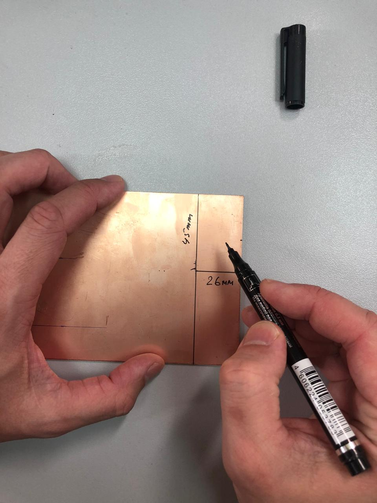
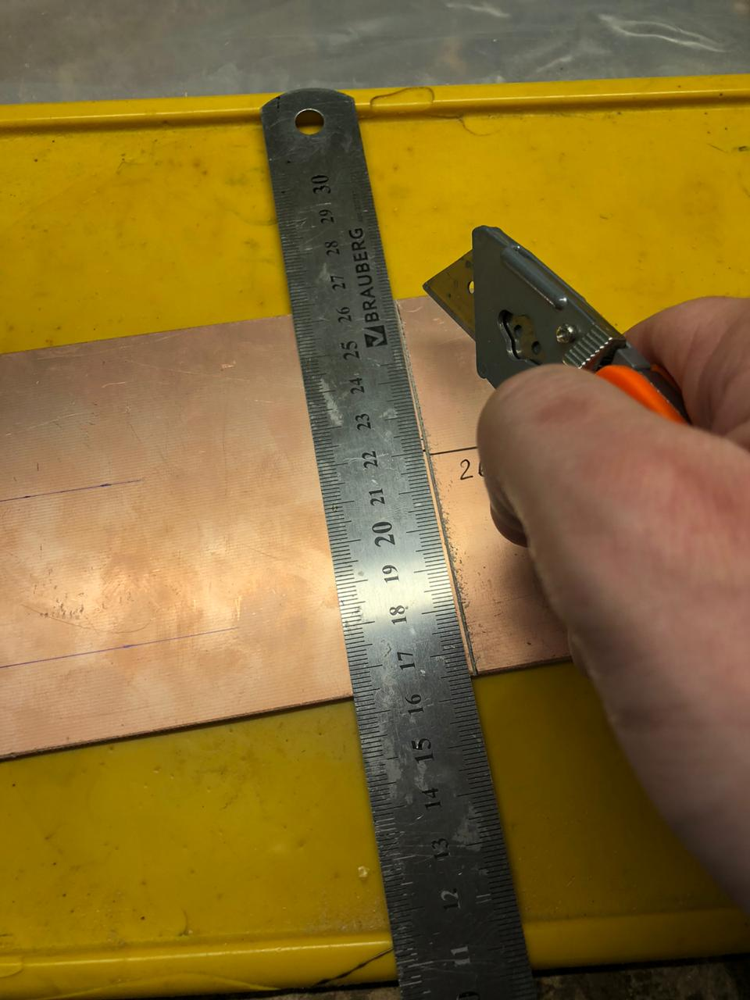
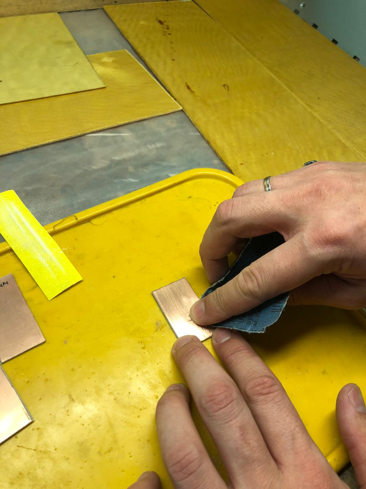
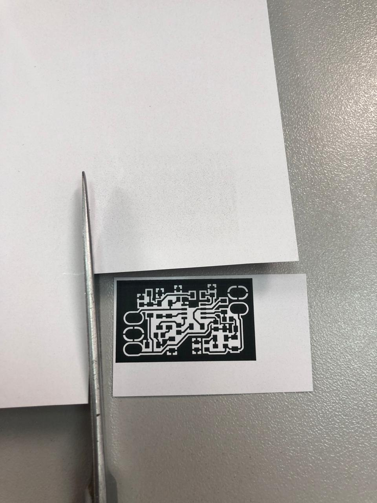
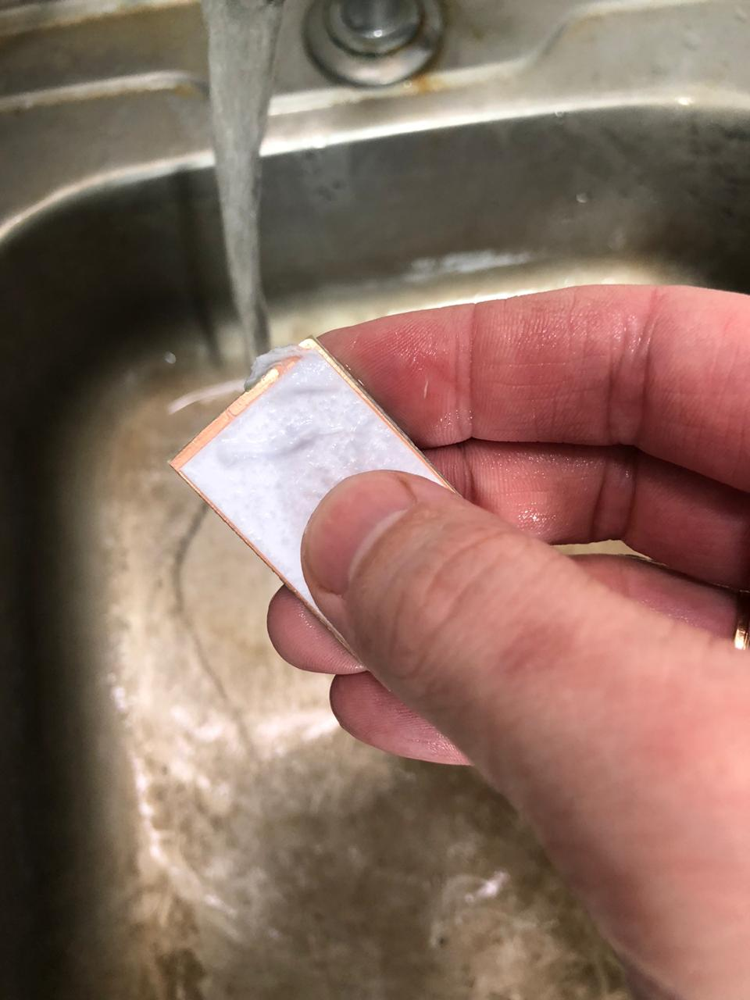
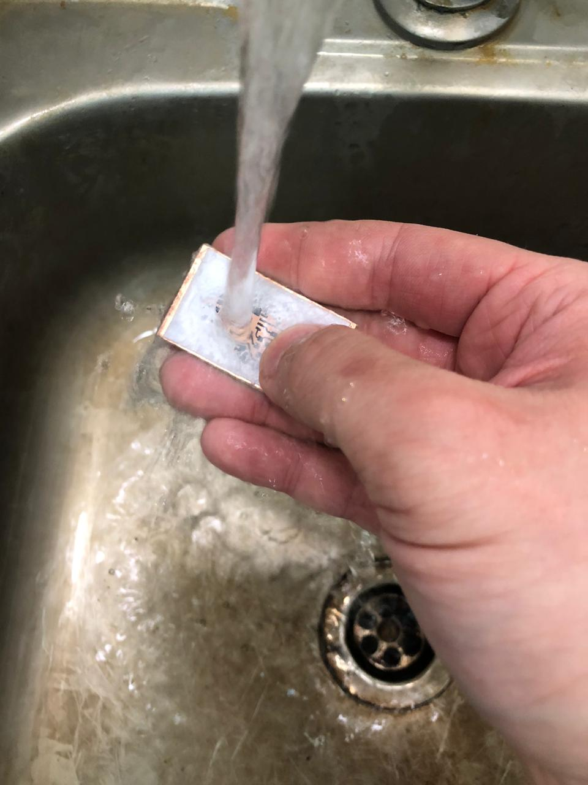
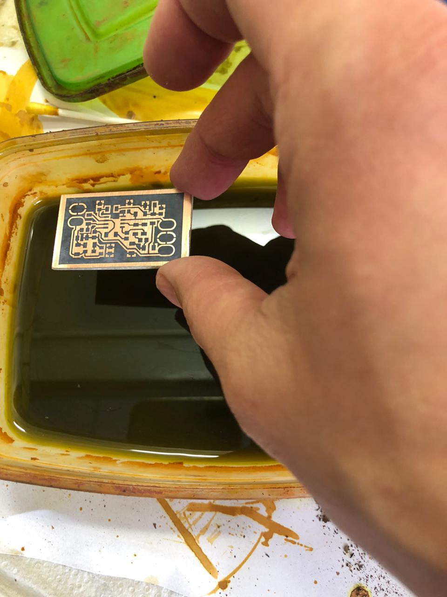
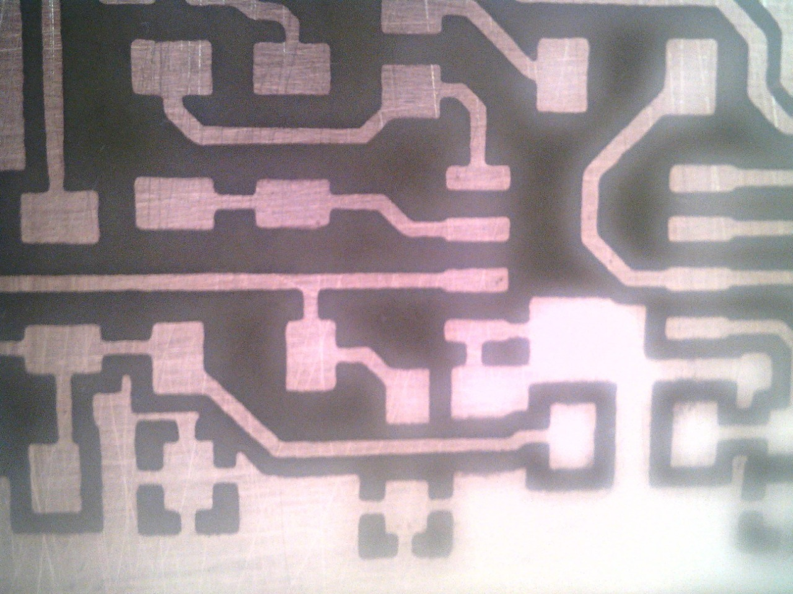
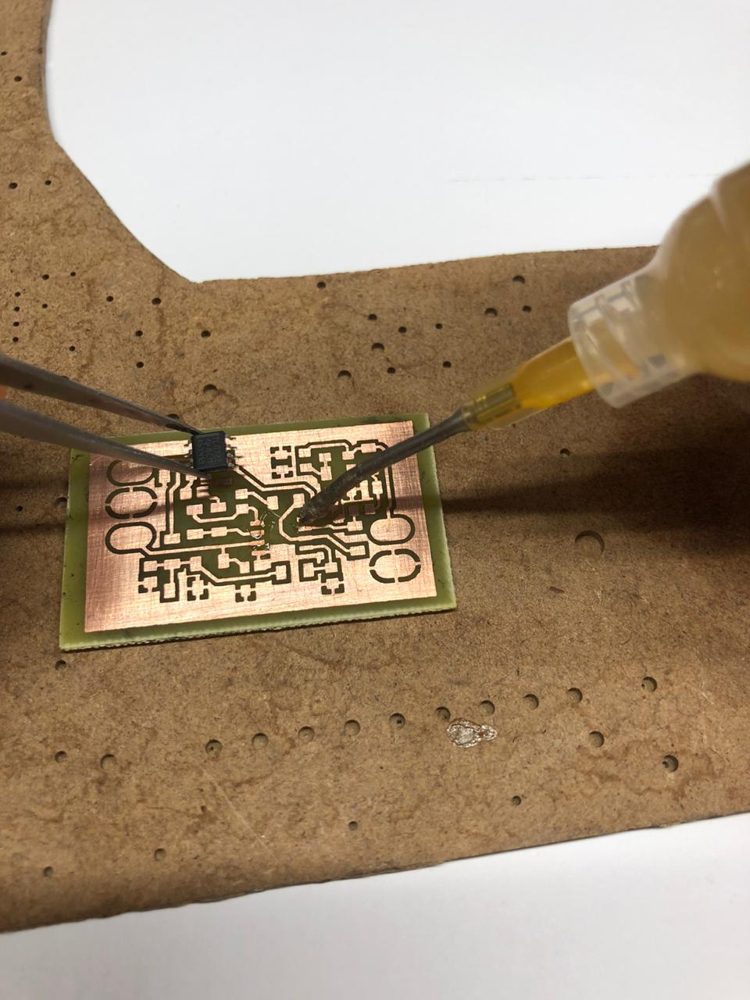
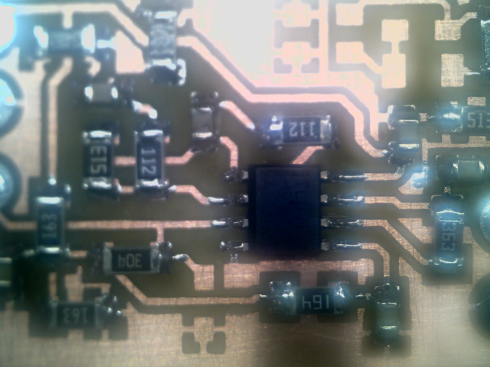

|  |
| :---: |
| [www.diy.unavlab.com](https://diy.unavlab.com/)   [support@unavlab.com](mailto:support@unavlab.com) |
| [**EN**](README.md) \| [**RU**](README_RU.md) |

# Project 2: Making a hydrophone preamplifier

### Contents
- [0. Disclaimer](#0-disclaimer)
- [1. What will be the result?](#1-what-will-be-the-result)
- [2. What do we need?](#2-what-do-we-need)
   - [2.1. Materials and equipment](#21-materials-and-equipment)
- [3. Manufacturing](#3-manufacturing)
   - [3.1. Manufacturing the PCB](#31-manufacturing-the-pcb)
   - [3.2. Assembling the PCB](#32-assembling-the-pcb)
   - [3.3. Connecting the hydrophone and connectors](#33-connecting-the-hydrophone-and-connectors)
- [4. Checking](#4-checking)

## 0. Disclaimer
**We are not responsible if you get hurt in any way while completing this tutorial. By following this tutorial, you agree that you are acting at your own risk. Strictly follow the rules and safety precautions when working with this or that tool or materials.**

## 1. What will be the result?
As a result, you will have a _full-fledged hydrophone with a preamplifier_ that can be powered from the _USB-port_ of any laptop and record underwater sounds using the laptop's _sound card_.

It is assumed that you already have a disk hydrophone that we made in [previous project](/projects/disk_hydrophone/).
If you have any other hydrophone you can try connecting it to this preamp.

For brevity, we will refer to the preamplified hydrophone as the "active hydrophone".
This is how your new active hydrophone will look like:

|  |
| :---: |
| fig. 1 - The active hydrophone is the end goal of this tutorial |

In this tutorial, we will be making a preamplifier PCB. We tried to make manufacturing _as simple as possible_: the board uses _only planar components_ and you don't even have to drill anything, and the _total cost_ of all components on the board does not exceed _a half of a dollar_ (2020).
We hope that this project can be carried out even by schoolchildren in technology lessons or in any technical circle. If you have experience in the manufacture of electronic devices, do not pay attention to extra detail =).

If you're ready, we get down to business immediately.

## 2. What do we need?
### 2.1. Materials and equipment
Figure 2 shows a schematic diagram of the preamplifier for general understanding and in case you want to wire the board yourself.

|  |
| :---: |
| fig. 2 - The preamplifier board |
| Schematic |

And figure 3 shows the location of the elements on the PCB.

|  |
| :---: |
| fig. 3 - The preamplifier board |
| The arrangement of components on the PCB |

### Table 1 - List of electronic components for the board

| № | Designation | Name | Package | Role |
| :--- | :--- | :--- | :--- | :--- |
| 1 | DA1 | TL072 | SOIC8 | Operational amplifier |
| 2 | VD1 | SMF8.5A | SOD-123FL | Protection diode |
| 3 | VD2 | BZX384-C4V7,115 | SOD-123FL | Zener diode 5 Volt, to protect the MCU input, do not install in case of sound card |
| 4 | VD3, VD4 | A Schottky diode | SOD-323 | to protect MCU input, do not install in case of sound card |
| 5 | R1 | 300 kOhm | 1206 | applies an offset (virtual ground) to the non-inverting input of the first channel |
| 6 | R2, R3 | 0 Ohm | - | jumpers for easy board layout |
| 7 | R4 | 1.1 kOhm | 1206 | sets the gain of the first channel |
| 8 | R5 | 51 kOhm | 1206 | sets the gain of the first channel |
| 9 | R6, R7 | 16 kOhm | 1206 | form bias voltage equal to half of the supply voltage (virtual ground for unipolar circuits) |
| 10 | R8 | 160 kOhm | 1206 | the virtual ground filter of the second op-amp channel |
| 11 | R9 | 1.1 kOhm | 1206 | sets the gain of the first channel |
| 12 | R10 | 36 kOhm | 1206 | sets the gain of the first channel |
| 13 | R11, R12 | 51 kOhm | 1206 | for work with MCU, sets the voltage offset. If no offset is required, do not connect R12. |
| 14 | R13 | 1.1 kOhm | 1206 | output short-circuit protection |
| 15 | C1 | 1 uF | 0805 | filters noise on virtual ground |
| 16 | C2 | 0.1 uF | 0805 | power filter |
| 17 | C3 | 10 nF | 0805 | filters the low-frequency signal components and separates the DC component for a unipolar power supply to the non-inverting op-amp connection |
| 18 | C4 | 0.1 uF | 0805 | blocking capacitor between the first and second channels of the op-amp |
| 19 | C5 | 1 uF | 0805 | the virtual ground filter of the second op-amp channel |
| 20 | C6 | 0.1 uF | 0805 | blocking capacitor between the second channels of the operational amplifier and the board output |

Items **VD2, VD3, VD4, R12** set **only** in the case of connection of the preamplifier to a **MCU**. In case of connection of the preamplifier to a **PC sound card** the items **should not be soldered**.

### Table 2 - List of materials and equipment for manufacturing of the board

| № | Material/Equipment | Quantity | Notes |
| :--- | :--- | :--- | :--- |
| 1 | One- or two-sided fibreglass 0.5-2 mm FR4 18 um | 45 х 26 mm | |
| 2 | Ferric chloride FeCl3 | 2 table spoons for 250 ml of water | for pickling copper metallization |
| 3 | Isopropyl alcohol | ~100 ml | |
| 4 | Photo paper A4 110-210 g/m2 | 1 sheet | |
| 5 | Napkins or toilet paper | 1 pack / 1 roll | |
| 6 | Laser printer | | |
| 7 | Sandpaper 600 grit | little =) | |
| 8 | Eraser | 1 pcs. | |
| 9 | Breakfast container ~400-1000 ml flat | 1 pcs. | |
| 10 | Hacksaw | 1 pcs. | |
| 11 | Sharp knife | 1 pcs. | |
| 12 | Slim permanent marker | 1 pcs. | |
| 13 | Iron | 1 pcs. | |
| 14 | Wooden cutting board | 1 pcs. | |
| 15 | Metal ruler ~20-30 cm | 1 pcs. | |

### Table 3 - Other materials and equipment

| № | Material/Equipment | Quantity | Notes |
| :--- | :--- | :--- | :--- |
| 1 | Soldering iron or soldering station | 1 pcs | |
| 2 | Soft tin solder | немного =) | |
| 3 | Neutral rosin flux | немного =) | |
| 4 | Side cutters / Nippers | 1 pcs. | |
| 5 | Twizzers | 1 pcs. | |
| 6 | Cable with Jack 3.5 mm plug | 1 шт. ~0.5-1 m | |
| 7 | Cable with USB plug | 1 pcs. ~0.5-1 m | |

If you decide to order the manufacture of a PCB, then you will not need materials and tools from **Table 2** and you can safely skip paragraph 3.1.
To order a PCB, you will also need a [Gerber file] (preamp_pcb.GTL). You can order the manufacture of PCBs, for example, on the [JLCBCP](https://jlcpcb.com/).

## 3. Manufacturing
> **ATTENTION! Strictly follow the safety rules: during manufacturing, wear safety glasses - your eyes are not superfluous! It is very easy to damage them but it is also very easy to prevent it - WEAR PROTECTIVE GLASSES! Be careful with solvents - all work must be done with gloves and in a well-ventilated area! All electrical appliances - iron and soldering iron, if handled roughly, can cause serious injury, burns and electric shock. If you are minor - do work ONLY UNDER THE SUPERVISION OF ADULTS !!!**

Manufacturing can be divided into:
- PCB manufacturing
- soldering electronic components to the board;
- connection of hydrophone, power cable and signal output.

### 3.1. Manufacturing the PCB
So. You have selected the _full immersion mode_. It's a worthy choice.
If your piece of laminated fibreglass does not correspond to the required size, we size it with a ruler:

|  |
| :---: |
| fig. 5 - Fibreglass sheet marking |

We outline the grooves with a knife:

|  |
| :---: |
| fig. 6 - Fibreglass sheet marking |

And _neatly_, _not in a hurry_ saw off with a hacksaw for metal.
**Do not use metal scissors! They bend fibreglass!**

|  |
| :---: |
| fig. 7 - Sawing off a piece of the desired size |

Be sure to process the edges of the workpiece using sandpaper:

|  |
| :---: |
| fig. 8 - Processing the edges of the workpiece |

Activate the metallization surface with fine (600-1000 grit) sandpaper. Without fanaticism:

|  |
| :---: |
| fig. 9 - Activating the surface of the copper layer |

_Carefully_ wash the workpiece with alcohol or acetone:

|  |
| :---: |
| fig. 10 - Washing the workpiece |

Once again, _carefully_ wipe the metallization layer with a cotton swab dipped in alcohol or acetone:

|  |
| :---: |
| fig. 11 - Washing the workpiece |

The surface is now clean and grease-free, so you must not touch it with your hands. Let's put it aside for now and print the mask on photographic paper.
Here you will have a little space for research: you need to ensure that the mask is printed in the right size: 40x23.5 mm. We recommend that you try first on plain paper, and only if the printing scale is successful, print on photo paper.

Here is the mask image that needs to be printed. It is already mirrored, so you just need to print it at the correct size.
Just in case, let me remind you once again that you need a _laser printer_!

|  |
| :---: |
| fig. 12 - PCB mask (40 х 23.5 mm) |

We got it like this:
|  |
| :---: |
| fig. 13 - Printed mask |

_Carefully_ cut out with scissors, without touching the drawing with our hands. It is better if it fits perfectly in size to the workpiece - it will be easier to align.

|  |
| :---: |
| fig. 14 - Clipping the mask |

It's time to prepare the cutting board (we just have a piece of board =) and turn on the iron. Set the temperature on the iron to the maximum.
Put the workpiece on the board with metallization up, on top of it - a cutout mask, pattern down.

|  |
| :---: |
| fig. 15 - A moment before ... |

First, press it with an iron and make sure that the paper does not move relative to the workpiece. After a few seconds, when the toner has melted, you can gently smooth it out.

|  |
| :---: |
| fig. 16 - Ironing |

If you succeed, you can heat the workpiece on an inverted iron, like this:

|  |
| :---: |
| fig. 17 - Additional heating of the workpiece |

Then smooth it through a thin kitchen towel (ours is very dirty, but we do not use it for kitchen purposes =)

|  |
| :---: |
| fig. 18 - Iron it through a towel |

The total "ironing" time is usually 20-30 seconds. After smoothing, put the workpiece under running cold water. We soak the paper and roll it with our fingers from the workpiece.

|  |
| :---: |
| fig. 19 - The paper is soaked and "rolled" with fingers under running water |

|  |
| :---: |
| fig. 20 - The paper is soaked and "rolled" with fingers under running water |

|  |
| :---: |
| fig. 21 - The paper is soaked and "rolled" with fingers under running water |

When all the paper has been removed, carefully blot the blank with napkins and remove any remaining (if any) paper with a regular eraser.

|  |
| :---: |
| fig. 22 - Final cleaning of the workpiece with an eraser |

Now is the time to prepare the ferric chloride solution.

> **ATTENTION!!! The preparation of ferric chloride solution can be dangerous: the dissolution reaction is exothermic, i.e. comes with heat release! Be careful and slowly, in small portions, pour the chlorine iron into the water (AND NOT VICE VERSA!!!).**

> **ATTENTION!!! The solution is very dirty and very poorly washed. Do everything with gloves and an apron.**

Depending on the container used (we have a 700 ml container), select the appropriate volume of water and the weight of ferric chloride powder based on the proportion **2 heaped tablespoons for 1 cup (250 ml) of water**

After the solution is prepared, we lower our workpiece into the solution:

|  |
| :---: |
| fig. 23 - Lower the workpiece into a solution of ferric chloride |

Etching time is highly dependent on solution, temperature and printer. Therefore, periodically take out the workpiece with a wooden or plastic stick and check the condition.

|  |
| :---: |
| fig. 24 - Watching the etching process |

|  |
| :---: |
| рисунок 25 - Watching the etching process |

When the copper not covered with toner is completely dissolved, take out the workpiece and thoroughly rinse it in running water.

|  |
| :---: |
| fig. 26 - Rinsing in running water |

After rinsing, blot with napkins and check that there are no remaining, un-etched jumpers between the tracks. If there are any

|  |
| :---: |
| fig. 27 - Checking the absence of undissolved copper bridges |

In the picture above, there is just a copper bridge uneaten by ferric chloride. It can be removed either mechanically or with a cotton swab dipped in ferric chloride solution.

After the workpiece has been fully inspected, washed and dried, the toner can be washed off. Toner can only be washed off with acetone. The workpiece is wetted with acetone and the toner is removed with a cotton swab:

|  |
| :---: |
| fig. 28 - Washing toner with acetone |

|  |
| :---: |
| fig. 29 - Washing toner with acetone |

Once the toner is completely removed, the PCB manufacturing process can be considered complete.

In the figure below, for clarity, we show an image of the board under a microscope:

|  |
| :---: |
| fig. 30 - Enlarged image of the PCB |

You can safely proceed to the assembly!

### 3.2. Assembling the PCB

Assembling the board as a whole is not a hot and boring exercise. You need to prepare a soldering iron or soldering station. For soldering our preamplifier it is convenient to use a 1.6 - 2 mm concave tip.
We put the diagram and elements in front of us. Carefully and without fanaticism, we apply flux to the board, install the components and solder in turn. We start with an operational amplifier.

The sequence of actions is quite simple and is repeated for each element:

We apply flux:

|  |
| :---: |
| fig. 31 - Flux application |

Install the element:

|  |
| :---: |
| fig. 32 - Component installation |

We touch the solder thread with the tip of the soldering iron and solder the component pins:

|  |
| :---: |
| fig. 33 - Soldering the component |

After soldering all the components, we wash the board with a cotton swab dipped in alcohol. We got it like this:

|  |
| :---: |
| fig. 34 - Enlarged image of the PCB |

Congratulations! The most difficult part of the work was left behind. You are just great!

### 3.3. Connecting the hydrophone and connectors

So. Let's carry out an inventory. We have:
- preamplifier board
- hydrophone
- USB cable
- cable with Jack 3.5 mm plug

|  |
| :---: |
| fig. 35 - Preamplifier connection diagram |

На рисунке обозначены:

### Table 4 - Connection

| № | Designation | Role |
| :--- | :--- | :--- |
| 1 | VCC | Power - 5 Volts |
| 2 | Input signal | Center core of hydrophone cable - input signal |
| 3 | Output signal | Output signal - contacts of the Jack 3.5 connector for connection to a sound card |
| 4 | GND | Ground/Screen - For convenience, there are two pads: on the left, the power and hydrophone grounds are soldered, on the right - the gound of sound card connector |

We strip about 1 cm of total insulation for all cables at the ends and 1-2 mm for the cores.
Let's start with the power cable. USB cables usually have 4 conductors and a shield. Typically red and black are 5V and ground. The other two are used for data transfer and we do not need them - they do not need to be cleaned, we will leave them unconnected.
Just in case, we recommend using a multimeter to verify the purpose of the cores: connect the cable to USB and check that there are 5 volts between the black and red cores.
If you have a connector for connecting to a Stereo sound card (3 pins on a pin), then we solder the veins from the tip and middle contact together and put them on the Output signal. Common - to GND. The Mono connector has only two pins - the closest to the cable is always common.
The hydrophone is soldered the easiest way - the central core of the cable to the Input signal pad, the braid to GND. 
This is how we did it:

|  |
| :---: |
| fig. 36 - All cables are soldered to the board |

И общий план:

|  |
| :---: |
| fig. 37 - Everything is ready! |

## 4. Checking
All we need to check is a laptop or PC with a sound card. For our purposes, we need an application that allows you to record sound and display a spectrogram.
We are using Windows 10 and we can recommend the very convenient free application [Ocenaudio](https://www.ocenaudio.com/) for recording.
Plug the power cord into a USB port and the Jack plug into the mic-in port on your PC or laptop. Install the app and just hit the record button.
In some cases, you have to tinker with the system settings.
Some sound cards have a filter that limits all frequencies above about 15-17 kHz, but in most systems, frequencies up to half the sampling frequency are available to the user (in accordance with the Kotelnikov theorem).

Our setup looks like this (we specifically went to check everything in a small swimming pool):

|  |
| :---: |
| fig. 38 - Laptop with hydrophone on the "shore" of the pool |

We have a sufficiently powerful emitter, which is certainly not intended for such small "reservoirs", but we decided to use it, because these days the reservoirs are inaccessible - the first thin ice has formed on them, and it is no longer possible to swim, but it is still not thick enough to step on it. Therefore, we work with what we have =)

|  |
| :---: |
| fig. 39 - Emitter |

|  |
| :---: |
| fig. 40 - Distance between receiver and emitter 11 meters |

We have specially prepared a test [signal](test_sound_96kHz_sereo.wav) which consists of white noise, chirps and tonal signals. The following figure shows the process of recording a piece of white noise. White noise is useful for determining the frequency response of a system, but we'll talk about this some other time.

|  |
| :---: |
| fig. 41 - Recording in progress |

By the way, we attach to this tutorial [recording made in the pool](pool_test_signal.wav).

This concludes our tutorial, we hope you were interested =)

_______  
[Contents](#contents)

