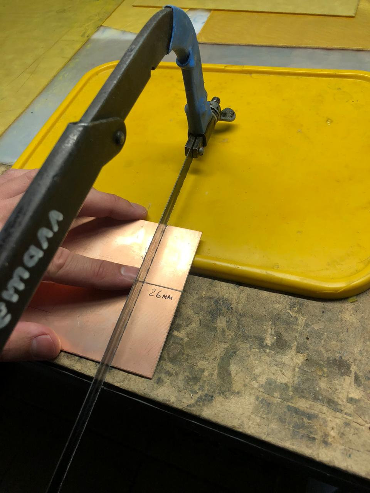

|  |
| :---: |
| [www.diy.unavlab.com](https://diy.unavlab.com/)   [support@unavlab.com](mailto:support@unavlab.com) |
| [**EN**](README.md) \| [**RU**](README_RU.md) |

# Проект №2: Изготовление предусилителя для гидрофона

### Содержание
- [0. Дисклеймер](#0-%D0%B4%D0%B8%D1%81%D0%BA%D0%BB%D0%B5%D0%B9%D0%BC%D0%B5%D1%80)
- [1. Что получится в результате?](#1-%D1%87%D1%82%D0%BE-%D0%BF%D0%BE%D0%BB%D1%83%D1%87%D0%B8%D1%82%D1%81%D1%8F-%D0%B2-%D1%80%D0%B5%D0%B7%D1%83%D0%BB%D1%8C%D1%82%D0%B0%D1%82%D0%B5)
- [2. Что нам понадобится?](#2-%D1%87%D1%82%D0%BE-%D0%BD%D0%B0%D0%BC-%D0%BF%D0%BE%D0%BD%D0%B0%D0%B4%D0%BE%D0%B1%D0%B8%D1%82%D1%81%D1%8F)

- [4. Проверка](#5-%D0%BF%D1%80%D0%BE%D0%B2%D0%B5%D1%80%D0%BA%D0%B0)

## 0. Дисклеймер
**Мы не несем ответственности, если вы поранитесь или каким-то образом пострадаете во время выполнения этого туториала. Следуя этому туториалу, вы соглашаетесь с тем, что действуете на свой страх и риск. Строго соблюдайте правила и технику безопасности при работе с тем или иным инструментом или материалами.**

## 1. Что получится в результате?
В результате у вас будет _полноценный гидрофон с предусилителем_, который можно питать от _USB-порта_ любого ноутбука и записывать при помощи _звуковой карты_ ноутбука подводные звуки.

Подразумевается, что у вас уже есть дисковый гидрофон, который мы изготовили в [предыдущем проекте](/projects/disk_hydrophone/README_RU.md). 
Если у вас есть какой-то другой гидрофон, вы можете попробовать подключить его к этому предусилителю.

Для краткости мы будем называть гидрофон с предусилителем _активным гидрофоном_.
Вот так будет выглядить ваш новый активный гидрофон в итоге:

|  |
| :---: |
| рисунок 1 - Активный гидрофон - конечная цель этого туториала |

В рамках данного туториала мы будем изготавливать печатную плату предусилителя. Мы постарались _сделать_ изготовление _как можно проще_: на плате применены _только планарные компоненты_ и вам даже не придется ничего сверлить, а _суммарная стоимость_ все компонентов на плате не превышает _30 рублей_ (2020 год).
Мы рассчитываем на то, что этот проект может быть выполнен даже школьниками под на уроках технологии или в каком-либо техническом кружке. Если вы имеете опыт в изготовлении электронных устройств, не обращайте внимание на излишнюю подробность =).

Если вы готовы, то мы немедленно переходим к делу.

## 2. Что нам понадобится?
### 2.1. Материалы и оборудование
На рисунке 2 приведена принципиальная электрическая схема предусилителя: для общего понимания и на случай если вы захотите выполнить разводку платы самостоятельно.

|  |
| :---: |
| рисунок 2 - Предусилитель |
| Схема электрическая принципиальная |

А на рисунке 3 изображено расположение элементов на печатной плате.

|  |
| :---: |
| рисунок 3 - Предусилитель |
| Расположение элементов на печатной плате |

### Таблица 1 - Список электронных компонентов для платы

| № | Обозначение на схеме | Наименование | Типоразмер/Корпус | Назначение |
| :--- | :--- | :--- | :--- | :--- |
| 1 | DA1 | TL072 | SOIC8 | |
| 2 | VD1 | SMF8.5A | SOD-123FL | защитный диод от входного импульсного высокого напряжения |
| 3 | VD2 | BZX384-C4V7,115 | SOD-123FL | стабилитрон на 5 Вольт, для защиты входа МК, если защита не требуется, то не устанавливать |
| 4 | VD3, VD4 | диод Шоттки | SOD-323 | защита входа МК, если защита не требуется, то не устанавливать |
| 5 | R1 | 300 кОм | 1206 | подает смещение (виртуальную землю) на неинвертирующий вход первого канала |
| 6 | R2, R3 | 0 Ом | - | перемычки для удобства разводки платы |
| 7 | R4 | 1.1 кОм | 1206 | задает коэффициент усиления первого канала |
| 8 | R5 | 51 кОм | 1206 | задает коэффициент усиления первого канала |
| 9 | R6, R7 | 16 кОм | 1206 | формируют смещения напряжения равное половине питающего напряжения (виртуальная земля для однополярных схем) |
| 10 | R8 | 160 кОм | 1206 | фильтр «виртуальной земли» второго канала операционного усилителя |
| 11 | R9 | 1.1 кОм | 1206 | задает коэффициент усиления первого канала |
| 12 | R10 | 36 кОм | 1206 | задает коэффициент усиления второго канала |
| 13 | R11, R12 | 51 кОм | 1206 | для работы с МК, задает напряжение смещение. Если смещение не требуется, то R12 не подключать |
| 14 | R13 | 1.1 кОм | 1206 | защита от короткого замыкания по выходу |
| 15 | C1 | 1 мкФ | 0805 | фильтрует помехи на «виртуальной земле» |
| 16 | C2 | 0.1 мкФ | 0805 | фильтр по питанию |
| 17 | C3 | 10 нФ | 0805 | фильтрует низкочастотные компоненты сигнала и отделяет постоянную составляющую для однополярного питания неинвертирующего включения операционного усилителя |
| 18 | C4 | 0.1 мкФ | 0805 | разделительный конденсатор между первым и вторым каналами операционного усилителя |
| 19 | C5 | 1 мкФ | 0805 | фильтр «виртуальной земли» второго канала операционного усилителя |
| 20 | C6 | 0.1 мкФ | 0805 | разделительный конденсатор между вторым каналам операционного усилителя и выходом платы |

Элементы **VD2, VD3, VD4, R12** устанавливаются **только** если предполагается подключать предусилитель **ко входу микроконтроллера**. При подключении **к звуковой карте ПК** эти элементы **не припаиваются**.

### Таблица 2 - Список материалов и оборудования для самостоятельного изготовления платы

| № | Материал/Инструмент | Количество | Примечания |
| :--- | :--- | :--- | :--- |
| 1 | Одно- или двухсторонний стеклотекстолит 0.5-2 мм FR4 18 мкм | 45 х 26 мм | |
| 2 | Хлорное железо FeCl3 | 2 ст. ложки на 250 мл воды | для травления металлизации |
| 3 | Спирт изопропиловый | ~100 мл | для протирки |
| 4 | Фотобумага A4 110-210 г/м2 | 1 лист | |
| 5 | Салфетки или туалетная бумага | 1 пачка / 1 рулон | |
| 6 | Принтер лазерный | | |
| 7 | Бумага наждачная 600 grit | немного =) | |
| 8 | Резинка стирательная | 1 шт. | |
| 9 | Контейнер для завтраков ~400-1000 мл плоский | 1 шт. | |
| 10 | Ножовка по металлу | 1 шт. | |
| 11 | Острый нож | 1 шт. | |
| 12 | Тонкий перманетный маркер | 1 шт. | |
| 13 | Утюг | 1 шт. | |
| 14 | Разделочная доска деревянная | 1 шт. | |
| 15 | Металлическая линейка | 1 шт. | |

### Таблица 3 - Прочие материалы и оборудование

| № | Материал/Инструмент | Количество | Примечания |
| :--- | :--- | :--- | :--- |
| 1 | Паяльник или паяльная станция | 1 шт | |
| 2 | Мягкий оловянный припой | немного =) | |
| 3 | Флюс нейтральный спиртоканифольный | немного =) | |
| 4 | Бокорезы/Кусачки | 1 шт. | |
| 5 | Пинцет | 1 шт. | |
| 6 | Кабель со штекером Jack 3.5 мм | 1 шт. ~0.5-1 м | |
| 7 | Кабель со штекером USB | 1 шт. ~0.5-1 м | |

Если вы решите заказать изготовление платы, то материалы и инстументы из **Таблицы 2** вам не потребуются и вы можете смело пропустить пункт 3.1.

## 3. Изготовление

> **ВНИМАНИЕ! Строго соблюдайте правила техники безопасности: во время изготовления надевайте защитные очки - глаза вам не лишние! Их очень легко повредить но и предотвратить это тоже очень просто - НАДЕВАЙТЕ ЗАЩИТНЫЕ ОЧКИ! Будьте аккуратны с растворителями - все работы должны выполняться в перчатках и в хорошо проветриваемом помещении! Используемые электроприборы - утюг и паяльник при небрежном обращении могут нанести серьезные травмы, ожоги и поражения электрическим током. Если вы несовершеннолетний - выполняйте работы ТОЛЬКО ПОД ПРИСМОТРОМ ВЗРОСЛЫХ!!!**

Изготовление условно можно разделить на:
- изготовление печатной платы
- напайку электронных компонентов на плату;
- подключение гидрофона, кабеля питания и выхода сигнала.

### 3.1. Изготовление печатной платы
Итак. Вы выбрали режим _полного погружения_. Это достойный выбор.
Если ваш кусок текстолита не соответствует требуемому размеру, размерчаем его при помощи линейки:

|  |
| :---: |
| рисунок 5 - Разметка листа стеклотекстолита |

Намечаем бороздки при помощи ножа:

|  |
| :---: |
| рисунок 6 - Разметка листа стеклотекстолита |

И _аккуратно_, _не спеша_ отпиливаем при помощи ножовки по металлу.  
**Не используйте ножницы по металлу! Они гнут стеклотекстолит!**

|  |
| :---: |
| рисунок 7 - Отпиливание куска нужного размера |

Обязательно обрабатываем края заготовки при помощи наждачной бумаги:

|  |
| :---: |
| рисунок 8 - Обработка краев заготовки |

Активируем поверхность металлизации мелкой (1000 grit) наждачной бумагой. Без фанатизма:

|  |
| :---: |
| рисунок 9 - Активировние поверхности медного слоя |

_Тщательно_ отмываем заготовку спиртом или ацетоном:

|  |
| :---: |
| рисунок 10 - Отмывка заготовки |

Еще раз _тщательно_ протираем слой металлизации ватной палочкой, смоченной в спирте или ацетоне:

|  |
| :---: |
| рисунок 11 - Отмывка заготовки |

Теперь поверхность очищена и обезжирена, поэтому нельзя касаться ее руками. Отложим ее пока и распечатаем маску на фотобумаге.
Здесь у вас будет небольшой простор для изысканий: необходимо добиться того, чтобы маска распечаталась в нужном размере: 40х23.5 мм. Рекомендуем попробовать сначала на обычной бумаге, и только при успешном подборе масштаба печати печатать на фотобумаге. 

Вот изображение маски, которое необходимо напечатать. Оно уже зеркально, так что вам нужно просто распечатать в правильном размере.
На всякий случай еще раз напомню, что нужен именно _лазерный принтер_!

|  |
| :---: |
| рисунок 12 - Маска (40 х 23.5 мм) |

У нас получилось так:

|  |
| :---: |
| рисунок 13 - Распечатанная маска |

_Аккуратно_ вырезаем ножницами, не касаясь самого рисунка руками. Лучше если он будет идеально подходить по размеру к заготовке - так будет удобнее выравнивать.

|  |
| :---: |
| рисунок 14 - Обрезка маски |

Самое время подготовить разделочную доску (у нас просто кусок доски =) и включить утюг. Температуру на утюге выставляем на максимум.
Кладем заготовку на доску металлизацией вверх, сверху на нее - вырезанную маску, рисунком вниз.

|  |
| :---: |
| рисунок 15 - За мгновение до... |

Сначала прижимаем утюгом и следим, чтобы бумага не сдвинулась относительно заготовки. Через несколько секунд, когда тонер расплавится можно аккуратно разглаживать.

|  |
| :---: |
| рисунок 16 - Греем и разглаживаем |

Если у вас получится - можно погреть заготовку на перевернутом утюге, вот так:

|  |
| :---: |
| рисунок 17 - Дополнительный прогрев заготовки |

Затем разглаживаем через тонкое кухонное полотенце (наше очень грязное, но мы не используем его в кухонных целях =)

|  |
| :---: |
| рисунок 18 - Разглаживаем через полотенце |

Общее время "разглаживания" обычно составляет секунд 20-30. После разглаживания _аккуратно_ кладем заготовку под проточную холодную воду. Размачиваем бумагу и скатываем ее пальцами с заготовки.

|  |
| :---: |
| рисунок 19 - Бумага размачивается и "скатывается" пальцами под струей воды |

|  |
| :---: |
| рисунок 20 - Бумага размачивается и "скатывается" пальцами под струей воды |

|  |
| :---: |
| рисунок 21 - Бумага размачивается и "скатывается" пальцами под струей воды |

Когда вся бумага будет удалена, тщательно промакните заготовку салфетками и удалите остатки (если таковые есть) бумаги обычной стирательной резинкой.

|  |
| :---: |
| рисунок 22 - Окончательная очистка заготовки стирательной резинкой |

Теперь настало время подготовить раствор хлорного железа.

> **ВНИМАНИЕ!!! Приготовление раствора хлорного железа может быть опасным: реакция растворения экзотермическая, т.е. идет с выделением тепла! Соблюдайте осторожность и медленно, мелкими порциями всыпайте хлорное железов в воду (А НЕ НАОБОРОТ!!!).**

> **ВНИМАНИЕ!!! Раствор очень сильно пачкается и очень плохо отмывается. Делайте все в перчатках и фартуке.***

В зависимости от используемого контейнера (у нас контенер на 700 мл) выбирайте соотвтетсвующий объем воды и массу порошка хлорного железа исходя из пропорции **2 столовые ложки с горкой на 1 стакан (250 мл) воды**

После того, как раствор будет приготовлен опускаем нашу заготовку в раствор:

|  |
| :---: |
| рисунок 23 - Опускаем заготовку в раствор хлорного железа |

Время травления сильно зависит от раствора, температуры и принтера. Поэтому периодически доставайте заготовку при помощи деревянной или пластиковой палочки и проверяйте состояние. 

|  |
| :---: |
| рисунок 24 - Наблюдаем за ходом процесса травления |

|  |
| :---: |
| рисунок 25 - Наблюдаем за ходом процесса травления |

Когда медь, не покрытая тонером полностью растворится, достаем заготовку и тщательно промываем в проточной воде.

|  |
| :---: |
| рисунок 26 - Промывка в проточной воде |

После промывки промакаем салфетками и проверяем отсутствие оставшихся, невытравленных перемычек между дорожками. Если такие есть

|  |
| :---: |
| рисунок 27 - Проверка отсутствия невытравленных перемычек |

На рисунке выше как раз есть несъеденная хлорным железом медная перемычка. Ее можно удалить или механически или при помощи ватной палочки, смоченной в растворе хлорного железа.

После того, как заготовка будет полностью проверена, отмыта и высушена, можно будет смыть тонер. Тонер смывается только ацетоном. Заготовка смачивается ацетоном и тонер удаляется при помощи ватной палочки:

|  |
| :---: |
| рисунок 28 - Отмывка тонера при помощи ацетона |

|  |
| :---: |
| рисунок 29 - Отмывка тонера при помощи ацетона |

После того, как тонер будет полностью удален процесс изготовления печатной платы можно считать полностью завершенным. 

На рисунке ниже для наглядности мы приводим изображение платы под микроскопом:

|  |
| :---: |
| рисунок 30 - Увеличенное изображение платы |

Можно смело переходить к сборке!

### 3.2. Сборка платы

Сборка платы в целом не хотрое и скучное мероприятие. Вам нужно подготовить паяльник или паяльную станцию. Для пайки нашего предусилителя удобно использовать жало "микроволна" 1.6 - 2 мм.
Кладем перед собой схему, элементы. Аккуратно и без фанатизма наносим на плату флюс, устанавливаем компоненты и припаиваем по очереди. Мы начинаем с операционного усилителя.

Последовательность действий достаточно простая и повторяется для каждого элемента:

Наносим флюс:

|  |
| :---: |
| рисунок 31 - Нанесение флюса |

Устанавливаем элемент:

|  |
| :---: |
| рисунок 32 - Установка элемента |

Касаемся жалом паяльника нитки припоя и пропаиваем ножки элемента:

|  |
| :---: |
| рисунок 33 - Пропаивание элемента |

После напайки всех элементов отмываем плату при помощи ватной палочки, смоченной в спирте. У нас получилось так:

|  |
| :---: |
| рисунок 34 - Увеличенное изображение платы |

### 3.3. Подключение гидрофона и разъемов

## 4. Проверка
