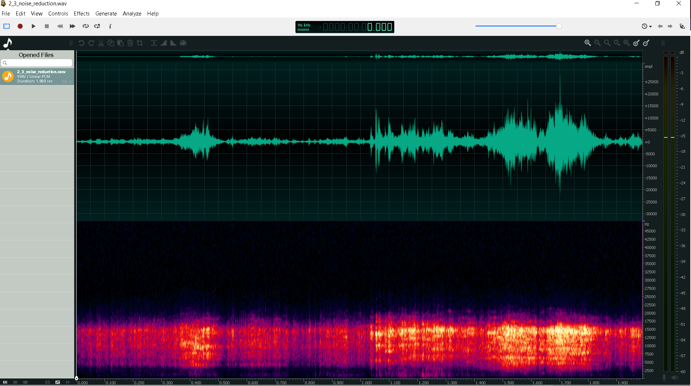

|  |
| :---: |
| [www.diy.unavlab.com](https://diy.unavlab.com/README_RU.html)   [support@unavlab.com](mailto:support@unavlab.com) |
| [**EN**](README.md) \| [**RU**](README_RU.md) |

# Appendix to [project 2](/projects/preamplifier_for_hydrophone/): recording of underwater sounds from under the ice

### Contents
- [Disclaimer](#disclaimer)
- [Introduction](#introduction)
- [Analysing fragment 1](#analysing-fragment-1)
- [Analysing fragment 2](#analysing-fragment-2)
- [Fragment 3](#fragment-3)

## Disclaimer
**ATTENTION!!! Water bodies are an increased source of danger, and if you are on the water or on the surface of the ice, it requires the strictest observance of safety rules!
If you have no experience, you have not been instructed in safety precautions or you are a minor - in no case go out on the water or ice of the reservoir !!!
If you repeat the experiments described in this material - you act at your own peril and risk - we are not responsible for your safety!**

## Introduction
In this article we describe the experience of using a previously made [hydrophone with preamplifier](/projects/preamplifier_for_hydrophone/README_RU).
At the beginning of December, we were very lucky with the weather - sunny, calm, in two weeks of frost the ice on small reservoirs gained sufficient strength. We have just prepared prototypes of equipment for testing our new tracking system [WAYU](https://docs.unavlab.com/navigation_and_tracking_systems_en.html#wayu) and went at one of the crossings in the [Volgo-Don Shipping Canal](https://goo.gl/maps/rmktnCWcauE4HbcZ6). We decided not to miss the chance to test our hydrophone in a real reservoir - this is, firstly, an excellent demonstration of its capabilities, and secondly, using real recordings as an example, we can teach the simplest techniques for working with sound recordings.

Winter bodies of stagnant water enclosed in ice cover are ideal conditions for recording underwater sounds because there is no noise from wind waves and shipping.

So. Our headquarters on the ice looked like this:

|  |
| :---: |
| fig. 1 - "Office-to-go" |

The laptop is generally not designed to operate in cold temperatures, and most of the time ours runs on a converter connected to a large 12-volt battery. Unfortunately, the converter produces a very strong impulse noise that gets into the recording. Therefore, during the recording, we disconnect the laptop from external power.

Our hydrophone is made of available materials (so that those who want to repeat this design do not have problems with supplies) and the insulation of the RG-174 cable is made of PVC, which hardens in the cold and is difficult to pull in line after it has been frozen.
In commercial devices, we only use cables with polyurethane insulation, which does not have this disadvantage.

|  |
| :---: |
| fig. 2 - Llowering the hydrophone into the ice-hole |

With some effort, the hydrophone is lowered into the ice-hole. In some cases, especially if the cable is long and you want to lower the device to a great depth, you will have to tie some kind of weight to it - so that the cable straightens under its weight.

|  |
| :---: |
| fig. 3 - Everything is ready to go |

This winter there was a rare situation - the frosts stood long enough for the ice to gain strength, and there was practically no precipitation. In such cases, we move along the surface of the reservoir on skates =)

|  |
| :---: |
| fig. 4 - The hydrophone perfectly senses the creak of skates on the ice |

Ice on water bodies often cracks (you can get scared out of habit). Such cracks appear:

|  |
| :---: |
| fig. 5 - A crack in ice |

Sometimes, if a crack appears somewhere nearby, a loud crunch is heard. But more often you can hear (and sometimes even feel with your feet) the sound of a crack spreading somewhere far away. It is quite characteristic and it is difficult to confuse it with something.

## Analysing fragment 1

We thought it would be nice to use the example of such a sound to make out the most basic techniques for working with a hydrophone and a sound editor. Although our hydrophone is designed to record sounds from about 10 kHz, and the sound of a diverging crack is clearly low-frequency, we nevertheless made a couple of recordings 3-4 minutes long, in which several such sounds were clearly supposed to be.

Finding them in a long recording is not so easy - you need to carefully review and listen to the entire recording. Therefore, we have already selected the appropriate short chunk:

|  |
| :---: |
| fig. 6 - fragment 1 |

For recording and manipulating sound, we used a very convenient free application [Ocenaudio](https://www.ocenaudio.com/).
You can download it and download a fragment of the recording made by us yourself:

### [Fragment 1: source signal](1_0_source_signal.wav)

To make it look the same as in the screenshot above, select the **View** > **Waveform & Spectral View** menu item or just press **Ctrl + 3**.
In the time domain (the upper half of the window), the eye does not cling to anything, and on the spectrogram (the lower half of the window), approximately 150 msec from the beginning, a powerful "burst" is seen (considering that it is outside the working band of the hydrophone) in the several hundred by a couple of kilohertz.

> A low-pass filter is a low-pass filter, it filters _low frequencies_ from _high_. This term is often confusing. In this case, it is convenient to recall the English name _Lowpass filter_, which means _low pass_.

To highlight this area, you can apply a low-pass filter to the entire signal, thereby filtering out all frequencies above about 2 kHz.
To do this, select the **Effects** > **Filter** > **Lowpass Filter ...** menu item. In the dialogue box that appears, set the upper filter frequency (passband limit) to about 2 kHz:

|  |
| :---: |
| fig. 7 - Lowpass Filter dialogue box |

The filter will suppress all frequencies above about 2 kHz.
### [Fragment 1: lowpass](1_1_lowpass.wav)

Now the signal looks a little different:

|  |
| :---: |
| fig. 8 - The result of the low-pass filter |

The excess background is almost completely suppressed, but the signal volume is clearly insufficient. To fix this we _normalize_ the signal. To do this, select the **Effects** > **Normalize** menu item. The result will be a signal like this:

### [Fragment 1: lowpass + normalisation ](1_2_normalized.wav)

|  |
| :---: |
| fig. 9 - lowpass + normalisation |

After normalization, the level of noise also increased slightly, so you can perform noise reduction. Ocenaudio has a convenient automatic function for this: select the menu item **Effects** > **Noise Reduction** > **Automatic Noise Reduction**.

Now you can enjoy the results of your work and listen to the final result. The sound of the expanding crack is now clearly audible, and even a small echo can be heard following the main burst.

### [Fragment 1: lowpass + narmalization + noise reduction](1_3_noise_reduction.wav)

|  |
| :---: |
| fig. 10 - lowpass + normalisation + noise reduction |

## Analysing fragment 2

As the second fragment, we propose to make out the sound of skates squeaking on the ice. All the steps here are exactly the same:

### [Fragment 2: source signal](2_0_source_signal.wav)

|  |
| :---: |
| fig. 11 - Fragment 2: source signal |

Since the creak of skates is a broadband signal, set the upper filter frequency to a value of about 15 kHz (close to the limit of our hearing):

### [Fragment 2: low-pass](2_1_lowpass.wav)

|  |
| :---: |
| fig. 12 - Fragment 2: low-pass |

### [Fragment 2: low-pass + normalization](2_2_normalized.wav)

|  |
| :---: |
| fig. 13 - Fragment 2: low-pass + normalization |

And the final result, after automatic noise reduction:

### [Fragment 2: low-pass + normalization + noise reduction](2_3_noise_reduction.wav)

|  |
| :---: |
| fig. 14 - Fragment 2: low-pass + normalization + noise reduction |

If you look closely (listen?), Then about in the middle of the recording you can hear a bang, but what is its nature we propose to figure it out on our own.

## Fragment 3

As a bonus, we suggest that you yourself do the same manipulations with the third fragment: subjectively, they are about 4 times more interesting than the first fragment:

### [Fragment 3: source signal](3_0_source_signal.wav)

We hope you enjoyed it. Thanks for your attention and good luck!

_______  
[Back to contents](#contents)

