|  |
| :---: |
| [www.diy.unavlab.com](https://diy.unavlab.com/README_RU.html)   [support@unavlab.com](mailto:support@unavlab.com) |
| [**EN**](README.html) \| [**RU**](README_RU.html) |

# Приложение к [проекту №2](/projects/preamplifier_for_hydrophone/README_RU): запись подводных звуков из-подо льда

### Содержание
- [Дисклеймер](#%D0%B4%D0%B8%D1%81%D0%BA%D0%BB%D0%B5%D0%B9%D0%BC%D0%B5%D1%80)
- [Введение](#%D0%B2%D0%B2%D0%B5%D0%B4%D0%B5%D0%BD%D0%B8%D0%B5)
- [Разбор фрагмента 1](#%D1%80%D0%B0%D0%B7%D0%B1%D0%BE%D1%80-%D1%84%D1%80%D0%B0%D0%B3%D0%BC%D0%B5%D0%BD%D1%82%D0%B0-1)
- [Разбор фрагмента 2](#%D1%80%D0%B0%D0%B7%D0%B1%D0%BE%D1%80-%D1%84%D1%80%D0%B0%D0%B3%D0%BC%D0%B5%D0%BD%D1%82%D0%B0-2)
- [Фрагмент 3](#%D1%84%D1%80%D0%B0%D0%B3%D0%BC%D0%B5%D0%BD%D1%82-3)

## Дисклеймер
**ВНИМАНИЕ!!! Водоемы - повышенный источник опасности и приуствите на воде или на поверхности льда требует строжайшего соблюдения правил безопасности! 
Если у вас нет опыта, вы не прошли инструктаж по технике безопасности или являетесь несовершеннолетним - ни в коем случае не выходите на воду или лед водоема!!!
Если вы повторяете опыты, описываемые в данном материале - вы действуете на свой страх и риск - мы не несем ответственности за вашу безопасность!**

## Введение
В данной статье мы описываем опыт использования изготовленного нами ранее [гидрофона с предусилителем](/projects/preamplifier_for_hydrophone/README_RU).
В начале декабря нам очень повезло с погодой - солнечная, безветренная, за две недели морозов лед на небольших водоемах набрал достаточную прочность. Мы как раз подготовили макетные образцы оборудования для испытания нашей новой трекинговой системы [WAUY](https://docs.unavlab.com/navigation_and_tracking_systems_ru.html#wayu) и собрались на один из переходов в [Волго-Донском судоходном канале](https://goo.gl/maps/rmktnCWcauE4HbcZ6). Мы решили не упускать шанс проверить в условиях реального водоема наш гидрофон - это во-первых, отличная демонстрация его возможностей, а во-вторых, на примере реальных записей можно обучить простейшим приемам работы со звуковыми записями.

Зимние водоемы со стоячей водой закованные в ледяной покров - идеальные условия для записи подводных звуков, потому что шумы от ветрового волнения и судоходства отсутствуют.

Итак. Наш штаб на льду выглядел таким образом:

| 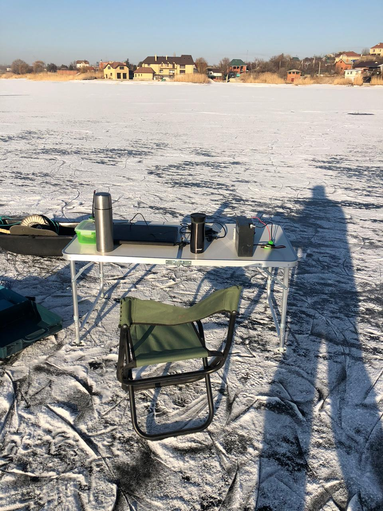 |
| :---: |
| рисунок 1 - "Офис на вынос" |

Ноутбук в общем не предназначен для работы при пониженных температурах и большую часть времени наш работает от преобразователя, подключенного к большому 12-вольтовому аккумулятору. К сожалению, преобразователь дает очень сильную импульсную помеху, которая попадает на запись. Поэтому на время записи мы отключаем ноутбук от внешнего питания. 

Наш гидрофон сделан из доступных материалов (чтобы у желающих повторить эту конструкцию не возникло проблем с комплектующими) и изоляция кабеля RG-174 выполнена из ПВХ, который дубеет на морозе и его сложно вытянуть после того, как он был смотан. 
В коммерческих устройствах мы используем кабели только с полиуретановой изоляцией, которая лишена такого недостатка.

|  |
| :---: |
| рисунок 2 - Опускаем гидрофон в лунку |

С некоторыми усилиями гидрофон опускается в лунку. В некоторых случаях, особенно если кабель длинный и хочется опустить устройство на большую глубину, придется привязатьк нему какой-то груз - чтобы кабель выпрямлялся под его весом.

|  |
| :---: |
| рисунок 3 - Все готово для работы |

Этой зимой сложилась редкая ситуация - морозы простояли достаточно долго чтобы лед успел набрать прочность, а осадков практически не было. В таких случаях мы передвигаемя по поверхности водоема на коньках =)

| 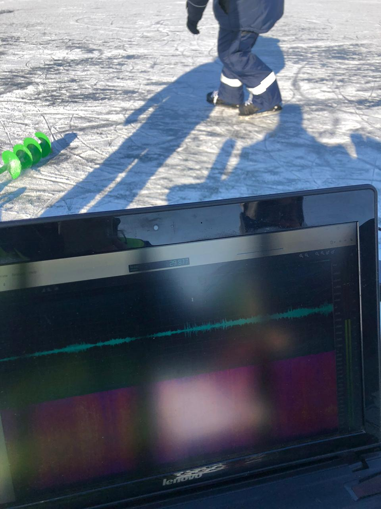 |
| :---: |
| рисунок 4 - Гидрофон отлично чувствует скрип коньков по льду |

Лед на водоемах часто трескается (с непривычки можно испугаться). Возникают вот такие трещины:

| 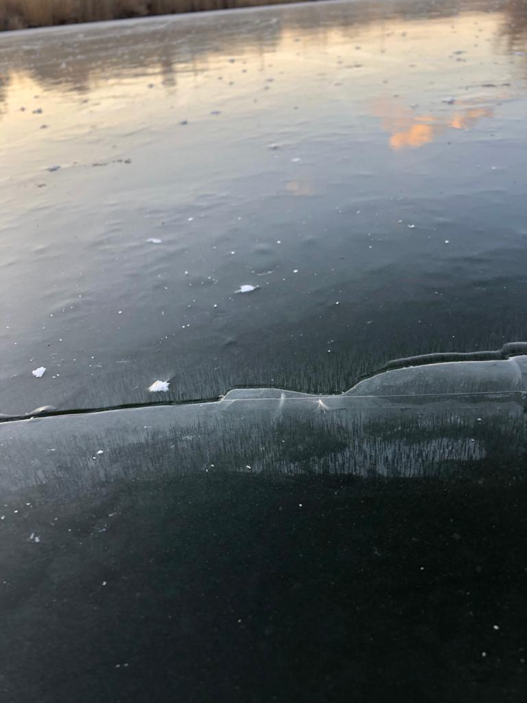 |
| :---: |
| рисунок 5 - Трещина во льду |

Иногда, если трещина возникает где-то рядом, слышится громкий хруст. Но чаще можно услышать (и иногда даже почувствовать ногами) звук расходящейся где-то далеко трещины. Он достаточно характерен и его сложно с чем-то спутать.

## Разбор фрагмента 1

Мы подумали, что неплохо было бы на примере такого звука разобрать самые базовые приемы работы с гидрофоном и звуковым редкатором. Хоть наш гидрофон и предназначен для записи звуков примерно от 10 кГц, а звук расходящейся трещины явно низкочастотный, мы все же сделали пару записей длительностью по 3-4 минуты, на которых явно должны были попасть несколько таких звуков. 

Найти их в длинной записе не так просто - нужно внимательно просмотреть и прослушать всю запись. Поэтому мы уже выбрали соотвтетсвующий короткий кусок:

| 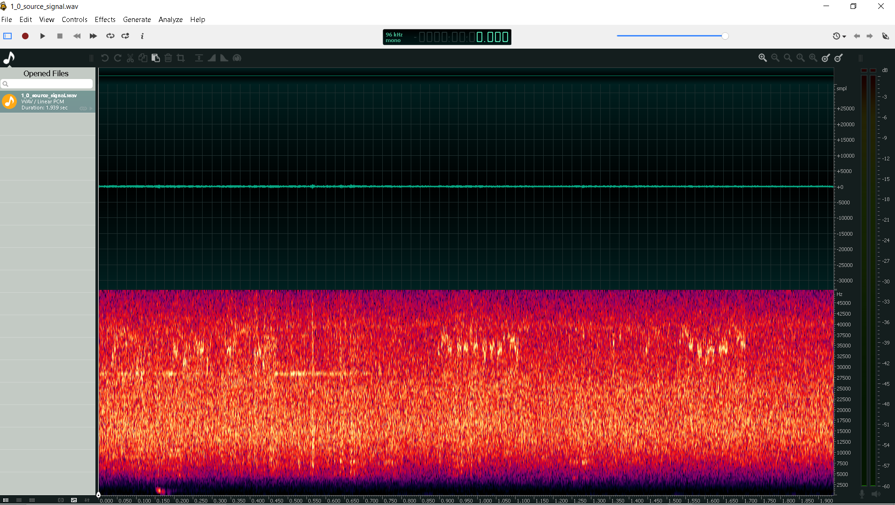 |
| :---: |
| рисунок 6 - Фрагмент записи №1 |

Для записи и манипуляций со звуком мы использовали очень удобное бесплатное приложение [Ocenaudio](https://www.ocenaudio.com/). 
Вы можете скачать его и сами загрузить фрагмент записи, сделенной нами:

### [Исходный фрагмент записи №1](1_0_source_signal.wav)

Чтобы он выглядел также, как и на скриншоте выше, выберите пункт меню **View** > **Waveform & Spectral View** или просто нажмите **Ctrl + 3**.
Во временной реализации сигнала (верхняя половина окна) глаз ни за что не цепляется, а на спектрограмме (нижняя половина окна) примерно через 150 мсек от начала  виден мощный "всплеск" (учитывая то, что он находится вне рабочей полосы гидрофона) в полосе от нескольких сотен по пары килогерц.

> НЧ-фильтр - это фильтр низких частот, он фильтрует _низкие частоты_ от _высоких_. Часто этот термин вызывает путаницу. В этом случае удобно вспомнить английское название _Lowpass filter_, что означает _низкие проходят_.

Чтобы выделить этот участок, можно применить ко всему фрагменту НЧ-фильтр, тем самым отфильтровав все частоты выше примерно 2 кГц. 
Для этого выберите пункт меню **Effects** > **Filter** > **Lowpass Filter...**. В появившемся диалоговом окне установите верхнюю частоту фильтра (passband limit) на значении примерно 2 кГц:

| 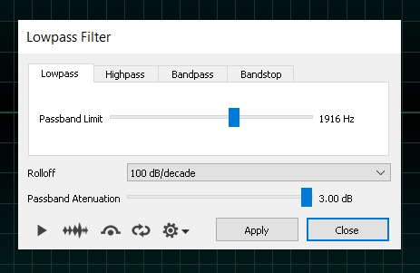 |
| :---: |
| рисунок 7 - Диалоговое окно Lowpass Filter |

Фильтр задавит все частоты выше примерно 2 кГц.
### [Фрагмент записи №1: НЧ фильтрация](1_1_lowpass.wav)

Теперь сигнал выглядит несколько иначе:

| 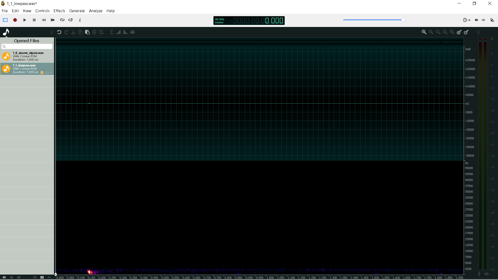 |
| :---: |
| рисунок 8 - Результат действия НЧ-фильтра |

Лишний фон практически полностью подавлен, но громкость сигнала явно недостаточна. Чтобы исправить это мы _нормализуем_ сигнал. Для чего выберем пункт меню **Effects** > **Normalize**. В результате получится такой сигнал:

### [Фрагмент записи №1: НЧ фильтрация + нормализация](1_2_normalized.wav)

| 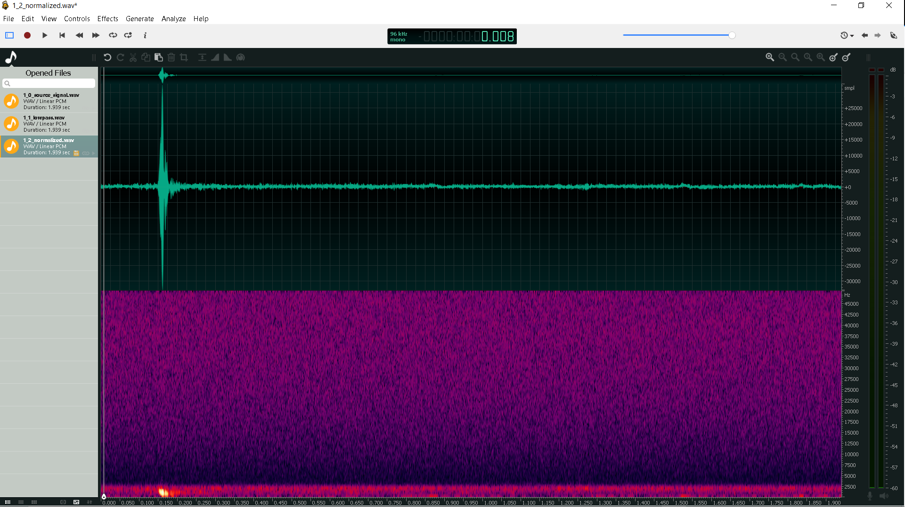 |
| :---: |
| рисунок 9 - НЧ-фильтр + нормализация |

Вместе с нормализацией немного вырос и уровен шумов, поэтому можно еще выполнить шумоподавление. В ocenaudio есть для этог удобная автоматическая функция: выбираем пункт меню **Effects** > **Noise Reduction** > **Automatic Noise Reduction**.

Теперь можно насладиться результатами работы и прослушать конечный результат. Звук расходящейся трещины теперь слышен отчетливо, и даже можно расслышать небольшое эхо, следующее за основным всплеском.

### [Фрагмент записи №1: НЧ фильтрация + нормализация + автошумоподавление](1_3_noise_reduction.wav)

| 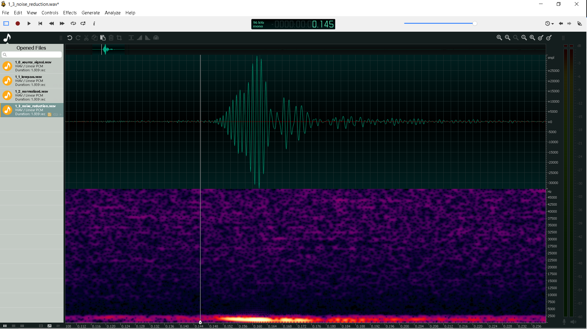 |
| :---: |
| рисунок 10 - НЧ-фильтр + нормализация + автошумоподавление |

## Разбор фрагмента 2

В качестве второго фрагмента предлагаем разобрать звук скрипа коньков по льду. Все этапы здесь в точности такие же:

### [Фрагмент записи №2: Исходный сигнал](2_0_source_signal.wav)

| 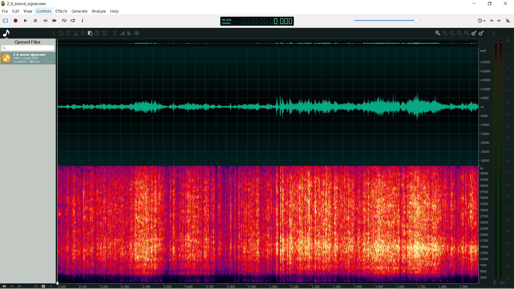 |
| :---: |
| рисунок 11 - Фрагмент №2: исходный сигнал |

Так как скрип коньков - это все-таки широкополосный сигнал, то верхнюю частоту фильтра установив на значение порядка 15 кГц (близко к пределу нашего слуха):

### [Фрагмент записи №2: НЧ-фильтрация](2_1_lowpass.wav)

| 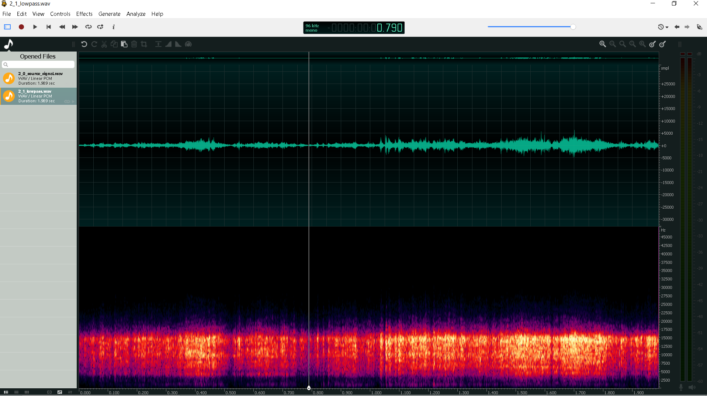 |
| :---: |
| рисунок 12 - Фрагмент №2: НЧ-фильтрация |

### [Фрагмент записи №2: НЧ-фильтрация + нормализация](2_2_normalized.wav)

| 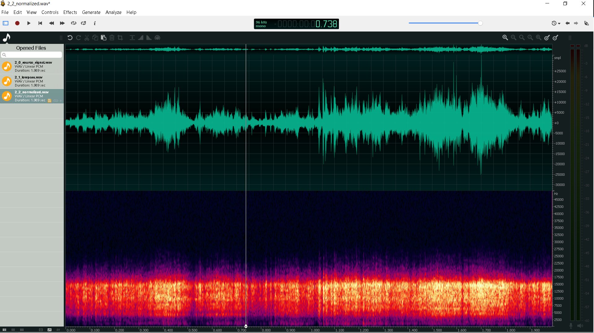 |
| :---: |
| рисунок 12 - Фрагмент №2: НЧ-фильтр + нормализация |

И окончательный результат, после автоматического шумоподавления:

### [Фрагмент записи №2: НЧ-фильтрация + нормализация + автошумоподавление](2_3_noise_reduction.wav)

|  |
| :---: |
| рисунок 12 - Фрагмент №2: НЧ-фильтр + нормализация + автошумоподавление |

Если приглядеться (прислушаться?) то примерно в середине записи слышен челчок, но какова его природа мы предлагаем разобраться самостоятельно.

## Фрагмент 3

В качестве бонуса предлагаем вам самим проделать такие же манипуляции с третьим фрагментом: субъективно, они примерно в 4 раза интересней первого фрагмента:

### [Фрагмент записи №2: Исходный сигнал](3_0_source_signal.wav)

Надеемся, что вам понравилось. Спасибо за внимание и удачи!

_______  
[К содержанию](#%D1%81%D0%BE%D0%B4%D0%B5%D1%80%D0%B6%D0%B0%D0%BD%D0%B8%D0%B5)

